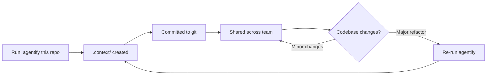

# 📁 Artifacts Guide

Understanding what ARCUS creates and why

---

## Directory Overview

ARCUS creates two main directory structures:

### `.context/` — Shared Repository Snapshot ✅ Committed to Git

**Purpose:** Persistent knowledge base about your repository

**Created by:** `repo-agentifier` skill (run once, refresh as needed)

**Shared across:** All stories, all team members (checked into git)

### `.arcus/` — Session Workspace ⚠️ Git-Ignored

**Purpose:** Per-story working data and pipeline state

**Created by:** Pipeline during story execution

**Private to:** Your local machine (not checked into git)

---

## Directory Tree

```
.context/                              # Shared repository snapshot (committed)
├── repo_scope.md                      # Repository boundaries, tech stack
├── repo_map.md                        # Navigation index (controllers, services, etc.)
├── flows/                             # Business flow documentation
│   ├── user-registration.md
│   ├── payment-processing.md
│   └── ...
└── testing-patterns.md                # Test framework conventions

.arcus/                                # Session workspace (git-ignored)
├── bin/                               # Helper scripts
│   ├── checkpoint.sh                  # State management
│   ├── branch.sh                      # Git operations
│   ├── commit.sh                      # Commit automation
│   ├── extract_story_id.sh            # Story ID parsing
│   └── pr.sh                          # PR creation
├── env                                # Environment variables (ARCUS_HOME)
├── session-checkpoint.json            # Pipeline state tracker
└── specs/                             # Story workspaces
    └── [STORY-ID]/
        ├── story.md                   # Original story (copy)
        ├── context-pack.md            # Story-specific context
        ├── plan.md                    # Consolidated planning deliberation
        ├── blueprint.md               # Machine-parsed atomic task list
        ├── test-plan.md               # Test matrix
        ├── review.md                  # Review findings
        └── PR_DESCRIPTION.md          # Final PR body
```

> **Note — deferred branch.** The story folder, `story.md` copy, and checkpoint are all
> created by the **`scaffold`** stage (`scaffold.sh`), which records the *planned* branch
> name but creates **no git branch**. The git branch is created later, at the start of
> Implementation, by the `branch` stage. See `session-checkpoint.json` below.

---

## `.context/` Files (Shared Repository Context)

### `repo_scope.md`

**Created by:** `repository-context-builder` (via `repo-agentifier`)

**Purpose:** Define repository boundaries and technical scope

**When to refresh:** After major codebase refactoring or tech stack changes

**Safe to edit:** ✅ Yes, manually tune scope if needed

**Contains:**
- Tech stack list (languages, frameworks, databases)
- Repository boundaries (what's included, what's excluded)
- Ignored patterns (build artifacts, dependencies, generated code)
- Verification commit hash (for staleness detection)

**Example excerpt:**
```markdown
## Tech Stack
- Node.js 18+
- TypeScript 5.0
- Express.js
- PostgreSQL 14
- Jest (testing)

## Excluded
- node_modules/
- dist/
- coverage/
```

---

### `repo_map.md`

**Created by:** `repository-context-builder` (via `repo-agentifier`)

**Purpose:** Navigation index for common architectural patterns

**When to refresh:** Same as repo_scope.md

**Safe to edit:** ✅ Yes, add custom navigation aids

**Contains:**
- File paths organized by architectural layer
- Controllers, services, repositories, utilities
- Test locations by layer (unit, integration, e2e)
- Configuration files
- Entry points

**Example excerpt:**
```markdown
## Controllers
- src/api/controllers/UserController.ts
- src/api/controllers/AuthController.ts

## Services
- src/services/UserService.ts
- src/services/EmailService.ts

## Repositories
- src/data/UserRepository.ts
```

---

### `flows/*.md`

**Created by:** `flow-and-scope-discovery` (via `repo-agentifier`)

**Purpose:** Document business flows with entry points and data touchpoints

**When to refresh:** When business logic changes significantly

**Safe to edit:** ✅ Yes, improve flow descriptions as needed

**Contains (per flow file):**
- **Entry Points:** Where the flow starts (API endpoints, CLI commands, events)
- **Core Path:** Step-by-step description of the flow
- **Data Touchpoints:** What data is read/written
- **Integrations:** External services, databases, message queues
- **Related Tests:** Where this flow is tested

**Example:** `flows/user-registration.md`
```markdown
## Entry Points
- POST /api/auth/register
- CLI: `user create`

## Core Path
1. Validate email and password
2. Check for existing user
3. Hash password
4. Create user record
5. Send welcome email
6. Return auth token

## Data Touchpoints
- Reads: users table (duplicate check)
- Writes: users table (new record)

## Integrations
- SendGrid (welcome email)
- Redis (session storage)

## Related Tests
- tests/integration/auth/registration.test.ts
- tests/e2e/user-flows.test.ts
```

---

### `testing-patterns.md`

**Created by:** `test-pattern-discovery` (via `repo-agentifier`)

**Purpose:** Capture testing conventions across all layers

**When to refresh:** After test framework changes

**Safe to edit:** ✅ Yes, document new patterns

**Contains:**
- Unit test framework (Jest, Vitest, pytest, JUnit, etc.)
- Integration test approach
- E2E test framework (Playwright, Cypress, Selenium, etc.)
- Mocking style (jest.mock, sinon, unittest.mock)
- Assertion patterns (expect, assert, should)
- Test execution commands per layer
- Coverage expectations

**Example excerpt:**
```markdown
## Unit Tests
- Framework: Jest
- Location: src/**/__tests__/*.test.ts
- Mocking: jest.mock for dependencies
- Run: `npm test`

## Integration Tests
- Framework: Jest with Supertest
- Location: tests/integration/**/*.test.ts
- Database: In-memory PostgreSQL (pg-mem)
- Run: `npm run test:integration`

## E2E Tests
- Framework: Playwright
- Location: tests/e2e/**/*.spec.ts
- Run: `npm run test:e2e`
```

---

## `.arcus/` Files (Session Workspace)

### `session-checkpoint.json`

**Created by:** `scaffold.sh` (the `scaffold` stage)

**Purpose:** Track pipeline state for resumability across sessions. Also records the
**planned** `branch_name` / `base_branch` (the git branch itself is created later, by the
`branch` stage; if the name is bumped on collision, `branch.sh` updates it via
`checkpoint.sh set-branch`).

**Safe to edit:** ⚠️ Rarely (can manually reset stage status if needed)

**Schema (illustrative):**
```json
{
  "story_id": "STORY-123",
  "mode": "gated",
  "branch_name": "arcus/STORY-123",
  "base_branch": "main",
  "stages": {
    "scaffold":       {"status": "complete"},
    "context_pack":   {"status": "complete"},
    "spec_finalizer": {"status": "in_progress"},
    "blueprint":      {"status": "pending"},
    "test_plan":      {"status": "pending"},
    "branch":         {"status": "pending"},
    "task_1":         {"status": "pending"},
    "code_review":    {"status": "pending"},
    "closure":        {"status": "pending"}
  },
  "review_round": 0,
  "last_updated": "2026-06-18T10:30:00Z"
}
```

**Status values:**
- `pending` — Not started
- `in_progress` — Currently running
- `awaiting_handoff` — Paused at gate, waiting for user
- `complete` — Finished
- `needs_rework` — Review failed, requires fixes

---

### `specs/[STORY-ID]/story.md`

**Created by:** `scaffold.sh` (the `scaffold` stage)

**Purpose:** Canonical copy of original story for reference

**Safe to edit:** ⚠️ Not recommended (use original file instead)

**Contains:** Exact copy of your input story file

---

### `specs/[STORY-ID]/context-pack.md`

**Created by:** `context-pack-builder` (the `context_pack` stage)

**Purpose:** Story-specific context bundle (relevant flows and patterns)

**Safe to edit:** ✅ Yes, add missing context before planning

**Contains:**
- Links to relevant `.context/flows/*.md` files
- Likely working areas (files to modify)
- Related patterns or conventions

---

### `specs/[STORY-ID]/plan.md`

**Created by:** `spec-finalizer` (the `spec_finalizer` stage)

**Purpose:** Single consolidated home for **all planning deliberation**. It consolidates
the two separate planning files used by earlier versions of ARCUS (technical decisions
and the gated-mode clarifications) into one file — those older files are gone, and no
skill reads them anymore.

**Safe to edit:** ✅ Yes, refine decisions before the `blueprint` stage

**Contains:**
- Architecture decisions (layering, patterns to use)
- Validation rules and error handling approach
- Performance constraints, security considerations, integration decisions
- **In gated mode:** the recorded Q&A from the recommendation-first interview (each
  question carried one **Recommended** option + rationale plus a custom-answer option)

**Example excerpt:**
```markdown
## Architecture Decisions
- Follow existing Controller → Service → Repository pattern
- Use UserService for business logic
- Validation at controller layer

## Error Handling
- Return 400 for validation errors
- Return 409 for duplicate email
- Use centralized error handler

## Validation
- Email format: RFC 5322
- Password: min 8 chars, require uppercase, number, special char

## Clarifications (gated dialogue)
- Q: Where should validation live? → A: Controller layer (Recommended)
```

> The **machine-parsed task list** lives separately in `blueprint.md` (below) — `plan.md`
> holds the human-readable deliberation, `blueprint.md` holds the structured tasks.

---

### `specs/[STORY-ID]/blueprint.md`

**Created by:** `implementation-planner` (the `blueprint` stage)

**Purpose:** Break story into atomic tasks with Definition of Done. This is the
**machine-parsed task list** the implementation loop reads.

**Safe to edit:** ✅ Yes, refine tasks before Implementation runs

**Contains:**
- Task list with IDs
- Complexity per task (heavy/medium/light) for model selection
- Affected files per task
- Definition of Done (how to verify completion)
- Success criteria

**Example excerpt:**
```markdown
## Task 1: Add email validation [MEDIUM]

**Affected files:**
- src/api/controllers/AuthController.ts
- src/validators/EmailValidator.ts

**Definition of Done:**
- Email validation function created
- RFC 5322 compliant
- Unit tests pass
- Invalid emails rejected with clear message

**Success Criteria:**
- `npm test src/validators/__tests__/EmailValidator.test.ts` passes
```

---

### `specs/[STORY-ID]/test-plan.md`

**Created by:** `test-spec-compiler` (the `test_plan` stage)

**Purpose:** Design test matrix before code is written (TDD)

**Safe to edit:** ✅ Yes, add missing test cases before Implementation

**Contains:**
- **Functional tests:** Happy path verification
- **Edge case tests:** Boundary conditions, null handling
- **Error handling tests:** Validation failures, exceptions
- Each test mapped to blueprint task ID

**Example excerpt:**
```markdown
## Functional Tests

### F1: Valid email acceptance [Task 1]
- Input: user@example.com
- Expected: Validation passes

### F2: Valid email with subdomain [Task 1]
- Input: user@mail.example.com
- Expected: Validation passes

## Edge Cases

### E1: Email with plus addressing [Task 1]
- Input: user+tag@example.com
- Expected: Validation passes

### E2: Single character local part [Task 1]
- Input: a@example.com
- Expected: Validation passes

## Error Handling

### R1: Missing @ symbol [Task 1]
- Input: userexample.com
- Expected: Error "Invalid email format"
```

---

### `specs/[STORY-ID]/review.md`

**Created by:** `code-reviewer` (the `code_review` stage)

**Purpose:** Consolidated review findings with verdict

**Safe to edit:** ❌ No (regenerated each review round)

**Contains:**
- **Deterministic gate results** — pass/fail/skipped per check (typecheck, full test suite, build + startup, secret scan, lint, format, static analysis), each with the command that was run
- Spec compliance issues
- Code quality issues (incl. cognitive complexity, test proportionality)
- Security vulnerabilities
- Performance concerns
- Severity per finding (critical/warning/suggestion)
- **Verdict:** `approved` or `changes_requested`

**Severity taxonomy:**
- **critical** — Blocks merge (outage, data loss, security breach)
- **warning** — Concrete issue (performance hit, maintainability)
- **suggestion** — Minor nit (non-blocking)

---

### `specs/[STORY-ID]/PR_DESCRIPTION.md`

**Created by:** `pull-request-builder` (the `closure` stage)

**Purpose:** Final PR body synthesized from all artifacts

**Safe to edit:** ⚠️ After the `closure` stage completes (for manual tweaks)

**Contains:**
- Story summary
- Key decisions (from `plan.md`)
- Implementation approach
- Test coverage
- Review status
- Breaking changes (if any)

---

## Editing Guidelines

### ✅ Safe to Edit (Before Next Stage)

**These files are meant to be reviewed and improved:**

- **All `.context/` files** — Improve documentation quality anytime
- **`plan.md`** — Refine decisions before the `blueprint` stage
- **`blueprint.md`** — Adjust task breakdown before Implementation
- **`test-plan.md`** — Add missing test cases before coding
- **`context-pack.md`** — Add missing context before planning

**Best practice:** In gated mode, edit at a handoff before saying "yes" to proceed

---

### ⚠️ Edit with Caution

**These files have specific schemas or workflows:**

- **`session-checkpoint.json`** — Only edit if you understand state schema
- **`story.md`** — Edit original file instead (this is a copy)
- **`PR_DESCRIPTION.md`** — Edit after the `closure` stage if needed, but regeneration overwrites

---

### ❌ Do Not Edit

**These files are regenerated and your changes will be lost:**

- **`review.md`** — Regenerated each review round
- **Scripts in `.arcus/bin/`** — Managed by bootstrap process

---

## File Lifecycle

### Shared Context (`.context/`)



### Story Workspace (`.arcus/specs/[ID]/`)


---

## Common Questions

**Q: Can I commit `.arcus/` to git?**  
A: Not recommended. It's git-ignored by design (workspace data, not source).

**Q: What if I accidentally delete `.arcus/`?**  
A: You lose pipeline state and will need to restart from the `scaffold` stage. Artifacts in `.context/` are safe (committed to git).

**Q: Should I commit `.context/` to git?**  
A: ✅ Yes! It's shared knowledge for your team.

**Q: How do I refresh stale context?**  
A: Re-run `agentify this repo` to regenerate `.context/`.

**Q: Where do I find my PR description after the closure stage?**  
A: `.arcus/specs/[STORY-ID]/PR_DESCRIPTION.md`

**Q: Can I reuse artifacts across stories?**  
A: `.context/` is reused automatically. `.arcus/specs/` is per-story.

---

## What's Next?

- **Understand the pipeline:** Ask "explain the pipeline"
- **See all commands:** Ask "command reference"
- **Choose a mode:** Ask "gated or afk?"
- **Get help:** Ask "troubleshooting"
