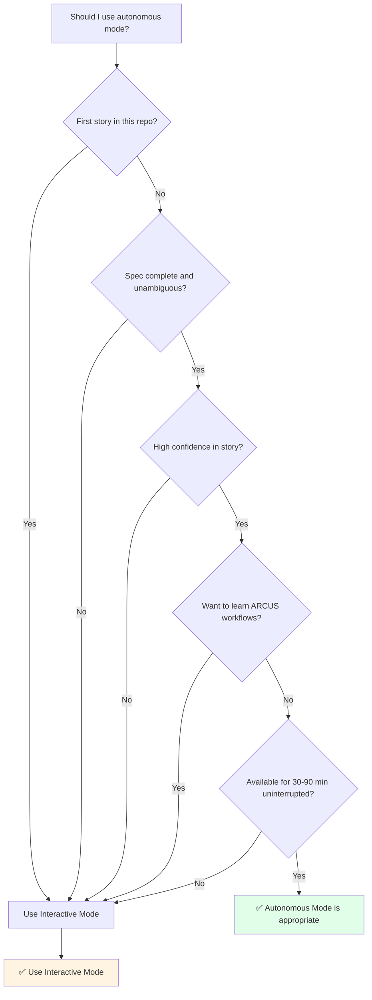

# ⚙️ Modes Explained

Choosing between Interactive and Autonomous modes

---

## Side-by-Side Comparison

| Aspect | Interactive Mode (Default) | Autonomous Mode (afk) |
|--------|---------------------------|----------------------|
| **Driver** | `arcus-controller` in interactive mode | `arcus-controller` in autonomous mode |
| **Control** | Pauses between stages | Runs all stages back-to-back |
| **User Role** | Review artifacts, say "yes"/"proceed" to advance | Hands-off until PR ready |
| **Best For** | Novel domains, high-risk changes, learning | Familiar codebases, simple features |
| **Intervention Points** | A handoff after each stage | Milestone-only output |
| **Session Resumability** | Yes — cold resume = the next stage's explicit phrase + the checkpoint | Resume-capable via checkpoint; intended to run uninterrupted |
| **Spec Finalization** | Recommendation-first dialogue (one question at a time, each with a Recommended option) | One-shot auto-resolution |
| **Output Verbosity** | Full progress updates at each gate | Compact, milestone output only |
| **When to Use** | Default for safety and learning | When you're confident in the spec |
| **Typical Duration** | 30-90 min active time (spread over hours/days) | 30-90 min uninterrupted |
| **Mistakes Caught** | Early (at each handoff before proceeding) | Late (after full implementation) |
| **Context Switching** | Friendly (pause anytime, resume later) | Hostile (must complete in one session) |

> Both modes use the same **`arcus-controller`** orchestrator. Interactive mode pauses at
> handoff gates for review; autonomous mode runs all stages unattended.

---

## Decision Tree

Should you use autonomous mode? Follow this flowchart:



---

## When to Choose Interactive Mode

✅ **First time using ARCUS in this repository**  
You need to see how ARCUS interprets your patterns

✅ **Story has ambiguities or missing details**  
Interactive mode asks clarifying questions with recommendations

✅ **Unfamiliar domain or complex requirements**  
Review each stage to catch misunderstandings early

✅ **Want to review each stage's output before proceeding**  
See `plan.md`, test plan, and implementation incrementally

✅ **Need to pause and resume across multiple sessions**  
Real work isn't always uninterrupted — interactive mode respects that

✅ **Learning how ARCUS works**  
See the workflow stage-by-stage to understand the process

✅ **High-risk changes (security, performance, critical paths)**  
Extra review gates prevent costly mistakes

✅ **Working with a new team or codebase**  
Verify ARCUS follows your conventions

---

## When to Choose Autonomous Mode

✅ **High-confidence, well-defined story**  
No ambiguities, clear acceptance criteria, obvious approach

✅ **Familiar codebase and domain**  
ARCUS knows your patterns, you trust its decisions

✅ **Simple feature or bug fix**  
Straightforward changes with low risk

✅ **Can dedicate 30-90 minutes uninterrupted**  
You're available for the full session without context switching

✅ **Trust ARCUS to handle ambiguities automatically**  
Spec finalizer's one-shot mode makes good default choices

✅ **Experienced ARCUS user**  
You know what to expect and trust the outputs

✅ **Tight deadline, need speed**  
Autonomous mode is faster (no handoff pauses)

---

## How to Trigger Each Mode

### Interactive Mode (Default)

Trigger with `implement` or `plan`:

```
implement story.md
plan story.md
```

No flags needed — interactive is the default.

**What happens:**
- `arcus-controller` runs in interactive mode
- Pipeline walks `scaffold → context_pack → spec_finalizer → blueprint → test_plan → branch → task_1..N → code_review → context_sync → closure`
- You advance with `yes` / `proceed` at each handoff (or `no` to pause)
- Cold-resuming a later stage uses that stage's explicit phrase — e.g.
  `generate test plan for story.md`, `review story.md`,
  `create pull request for story.md`

### Autonomous Mode (Opt-In)

Use an autonomous trigger:

```
run afk on story.md
forge story.md
afk story.md
```

**What happens:**
- `arcus-controller` runs in autonomous mode
- Every stage runs as a one-shot subagent, back-to-back
- No pauses (all handoffs auto-confirm)
- Milestone output only (less verbose)
- Returns when the PR is ready

---

## Example Scenarios

### Scenario 1: First Story in New Repo

**Situation:** You just agentified a new codebase, writing your first story

**Recommendation:** **Interactive Mode**

**Why:**
- ARCUS needs to learn your patterns
- You need to verify it understood your conventions
- Review `plan.md` and blueprint before code is written
- Catch misalignments early

**Command:**
```
implement story.md
```

---

### Scenario 2: 10th Story, Simple Bug Fix

**Situation:** Fixing a typo in validation message, well-understood change

**Recommendation:** **Autonomous Mode** (if time permits)

**Why:**
- You know exactly what needs to change
- Story is crystal clear ("Change error message from X to Y")
- Low risk, familiar code area
- ARCUS has proven pattern recognition in this repo

**Command:**
```
run afk on bug-fix-story.md
```

**Fallback:** Use interactive if you might be interrupted

---

### Scenario 3: Complex Feature, Unclear Requirements

**Situation:** Adding new authentication flow, some details TBD

**Recommendation:** **Interactive Mode**

**Why:**
- Ambiguities need resolution (interactive dialogue helps)
- Review `plan.md` before implementation starts
- Verify test coverage before code is written
- High-risk area (authentication)

**Command:**
```
implement auth-feature-story.md
```

---

### Scenario 4: Well-Defined Feature, Tight Deadline

**Situation:** Clear spec, familiar domain, need it done today

**Recommendation:** **Autonomous Mode** if story quality is high, else **Interactive**

**Why:**
- Speed matters (autonomous saves 10-15 min on handoffs)
- BUT: Only if spec is genuinely unambiguous
- Bad spec + autonomous = wasted time fixing wrong implementation

**Decision point:** Review your story:
- Clear acceptance criteria? → Autonomous candidate
- Any "TBD" or vague language? → Interactive (dialogue will save time)

**Command if clear:**
```
run afk on feature-story.md
```

---

## Switching Modes Mid-Pipeline

**Can I switch from interactive to autonomous mid-pipeline?**  
No, mode is set at pipeline start and persists through all stages.

**Can I switch from autonomous to interactive?**  
No, autonomous runs to completion without pauses.

**Workaround:** Pause at next gate (interactive only), restart with different mode if needed.

---

## Common Mistakes

### ❌ Using Autonomous for First Story
**Problem:** ARCUS hasn't learned your patterns yet  
**Result:** May miss conventions, generate non-idiomatic code  
**Fix:** Use interactive mode for first 2-3 stories, then switch to autonomous

### ❌ Using Interactive When Unavailable
**Problem:** Start interactive mode, then get interrupted and don't return for days  
**Result:** Context is stale, hard to remember where you were  
**Fix:** Use autonomous if you can't commit to reviewing gates promptly, or use `where am I?` to resume

### ❌ Using Autonomous with Vague Story
**Problem:** Spec has ambiguities, autonomous auto-resolves incorrectly  
**Result:** Implementation doesn't match intent, requires rework  
**Fix:** Use interactive dialogue to clarify ambiguities first

### ❌ Expecting Autonomous to Pause
**Problem:** Start autonomous mode, realize you need to intervene  
**Result:** Can't pause (no gates), have to let it complete or abort  
**Fix:** Only use autonomous when you're truly hands-off

---

## Mode Selection Checklist

Before running `implement story.md`, ask yourself:

**Interactive Mode if ANY of these are true:**
- [ ] First 1-3 stories in this repo
- [ ] Story has any ambiguities or unknowns
- [ ] I want to review each stage before proceeding
- [ ] I might need to pause and resume later
- [ ] I'm learning ARCUS or exploring workflows
- [ ] High-risk change (security, performance, core logic)

**Autonomous Mode if ALL of these are true:**
- [ ] Story is 100% clear and unambiguous
- [ ] I trust ARCUS patterns in this repo (not first story)
- [ ] I can dedicate 30-90 min uninterrupted
- [ ] I don't need to review intermediate artifacts
- [ ] Low-to-medium risk change
- [ ] I've used ARCUS successfully here before

**When in doubt:** Use **Interactive Mode** (default, safe)

---

## What's Next?

- **Understand the stages:** Ask "explain the pipeline"
- **See all commands:** Ask "command reference"
- **Check your setup:** Ask "getting started"
- **Get help:** Ask "troubleshooting"
- **Learn the architecture:** Ask "explain the capability library"
