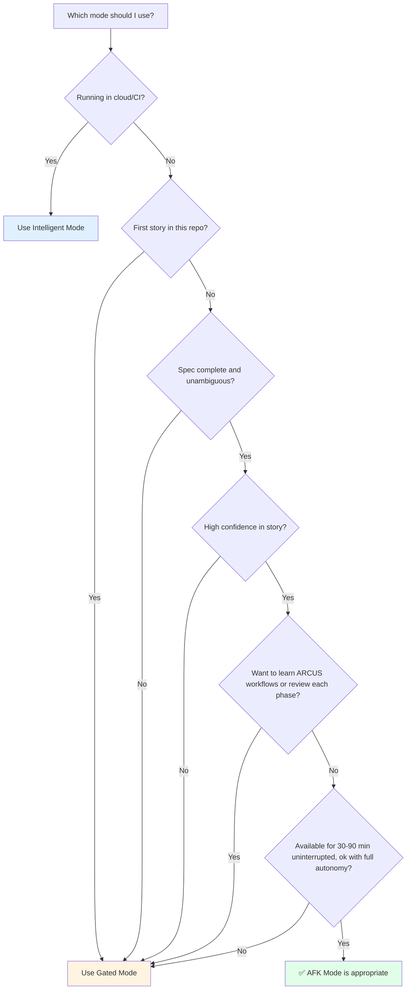

# ⚙️ Modes Explained

Choosing between `gated`, `intelligent`, and `afk` modes

---

## The Three Modes

All three modes are driven by the **same** `arcus-controller` orchestrator, running the **same**
canonical stage sequence to the pull request. They differ only in **whether, and where, the
pipeline pauses for a human**:

- **`gated` (default)** — everything `intelligent` does, **plus** configurable phase-boundary
  stops. Trigger it with `arcus <STORY>` (the default) or `plan <STORY>`. It surfaces any
  clarification questions the Brainstorm stages raised — all at once, in a single turn — and can
  *also* pause between phase groups (Test Plan → Implementation → Code Review → Context Sync), per
  the checkpoint's `stop_after` list. See **`.arcus/config.json`** below for how to shape that
  list. An absent or empty `stop_after` means no phase-boundary gate ever fires, even in `gated`
  mode — only a genuine open question stops the pipeline, exactly like `intelligent`.
- **`intelligent`** — stops only for a genuine open question raised during Brainstorm; **no**
  phase-boundary gates ever fire. This is **cloud's default behavior**: every ARCUS cloud/CI run is
  scaffolded with `--mode intelligent` explicitly, so a cloud run never gates on a phase boundary
  and never stalls waiting for a human who isn't there. Trigger it locally with
  `arcus <STORY> --intelligent`.
- **`afk` (autonomous, hands-off)** — open questions are recorded but never surfaced, so nothing
  ever stops. Trigger it with `afk <STORY>`, `forge <STORY>`, `run afk on <STORY>`, or
  `arcus <STORY> --afk`.

---

## Side-by-Side Comparison

| Aspect | `gated` (Default) | `intelligent` | `afk` (Autonomous) |
|--------|---------------------|----------------|----------------------|
| **Driver** | `arcus-controller` | `arcus-controller` | `arcus-controller` |
| **Control** | Stops for open questions, plus optional phase-boundary gates | Stops once, for open questions during Brainstorm | Never stops |
| **User Role** | Answer open questions, resume at each gate, then review the PR | Answer the open questions, then review the PR | Hands-off until PR ready |
| **Best For** | Novel domains, high-risk changes, learning ARCUS, staged review — the safe default | Cloud/CI runs, or a local run that wants question-gating without phase pauses | Familiar codebases, simple features, when you're confident in the spec |
| **Intervention Points** | Open questions, then each phase boundary in `stop_after`, then the PR | One batch of open questions (if any), then the PR | The PR |
| **Session Resumability** | Yes — designed to pause and resume across days or phase gates | Yes, can pause and resume across days | Resume-capable via checkpoint; intended to run uninterrupted |
| **Spec Finalization** | One-shot auto-resolution; `## Open Questions` shown to you as one batch (each with one Recommended option) | Same one-shot subagent — `## Open Questions` shown to you as one batch | Same one-shot subagent; `## Open Questions` recorded but never surfaced |
| **Output Verbosity** | Milestone output | Milestone output | Milestone output |
| **Typical Duration** | 30-90 min active time (spread over hours/days, more if phase gates are configured) | 30-90 min active time (spread over hours/days) | 30-90 min uninterrupted |
| **Mistakes Caught** | At the questions, at each configured phase boundary, or at the PR | At the questions (before any code) or at the PR | At the PR |
| **Context Switching** | Friendly (pause anytime, resume later) | Friendly (pause anytime, resume later) | Hostile (must complete in one session) |

> All three modes use the same **`arcus-controller`** orchestrator and produce the same
> milestone-only output — verbosity never varies by mode.

---

## `.arcus/config.json`: Narrowing the `gated` Stops

`gated` mode's phase-boundary gates default to pausing after **all three** transitions — Test Plan
→ Implementation, Implementation → Code Review, and Code Review → Context Sync. If you want fewer
stops, create an optional, developer-authored `.arcus/config.json` at the repo root **before**
scaffolding a `gated` story:

```json
{ "stop_after": ["test_plan", "implementation", "code_review"] }
```

List only the phase groups you actually want to pause after — the three valid keys are
`test_plan`, `implementation`, and `code_review`. For example, `{ "stop_after": ["code_review"] }`
pauses only before Context Sync and runs Test Plan → Implementation straight through.

A few things worth knowing about this file:

- **Location and scope.** It lives inside `.arcus/`, which is **gitignored** — the file is
  **per-machine**, not team-shared. Each developer (or CI runner) can carry a different one.
- **No script ever creates it.** It is pure opt-in: if the file doesn't exist, `gated` mode falls
  back to the built-in default of all three gates. Nothing in ARCUS writes, seeds, or scaffolds
  this file for you.
- **Read once, at scaffold time only.** It is consulted **only** while scaffolding a fresh story in
  `gated` mode, and **never again** — not on `resume <STORY>`, not mid-pipeline. `intelligent` and
  `afk` never read this file at all, even if it's present.
- **It narrows — it never reorders.** `stop_after` is an **unordered set**: the three transitions
  always fire in the same fixed pipeline order regardless of the order you list keys in the file,
  and duplicate keys collapse. The file can only ever *remove* gates from the default set of three,
  never add a fourth or reorder the existing ones.
- **Invalid input never breaks a story.** An unreadable file, malformed JSON, or a `stop_after`
  that isn't an array logs a warning and falls back to the built-in default (all three gates). A
  valid array containing unknown phase-group names or duplicates logs a warning, drops the bad
  entries, and keeps whatever valid ones remain — which may be none, resulting in `stop_after: []`
  (no phase-boundary gates at all, though open-question gating still applies).

---

## Decision Tree

Which mode should you use? Follow this flowchart:


```mermaid
graph TD
    A[Which mode should I use?] --> B{Running in cloud/CI?}
    B -->|Yes| CI[Use Intelligent Mode]
    B -->|No| C{First story in this repo?}
    C -->|Yes| G[Use Gated Mode]
    C -->|No| D{Spec complete and unambiguous?}
    D -->|No| G
    D -->|Yes| E{High confidence in story?}
    E -->|No| G
    E -->|Yes| F{Want to learn ARCUS workflows or review each phase?}
    F -->|Yes| G
    F -->|No| H{Available for 30-90 min uninterrupted, ok with full autonomy?}
    H -->|No| G
    H -->|Yes| AFK[✅ AFK Mode is appropriate]

    style AFK fill:#e1ffe8
    style G fill:#fff4e1
    style CI fill:#e1f0ff
```

---

## When to Choose Gated Mode

✅ **First time using ARCUS in this repository**
You need to see how ARCUS interprets your patterns

✅ **Story has ambiguities or missing details**
Gated mode surfaces the open questions as one batch for you to answer

✅ **Unfamiliar domain or complex requirements**
Review each phase's output before proceeding, using `.arcus/config.json` to choose which
boundaries pause

✅ **Want to review each stage's output before proceeding**
See `grounded-spec.md`, `plan.md`, test plan, and implementation incrementally

✅ **Need to pause and resume across multiple sessions**
Real work isn't always uninterrupted — gated mode respects that

✅ **Learning how ARCUS works**
See the workflow stage-by-stage to understand the process

✅ **High-risk changes (security, performance, critical paths)**
Extra phase-boundary gates prevent costly mistakes before they compound

✅ **Working with a new team or codebase**
Verify ARCUS follows your conventions

---

## When to Choose Intelligent Mode

✅ **Running in cloud/CI**
Every ARCUS cloud run uses this mode automatically — there's no human available to clear a phase
gate

✅ **You want question-gating without phase pauses**
You're confident enough to skip reviewing each phase, but still want ambiguities surfaced up front

✅ **Familiar codebase, but not 100% sure of every open question**
Answer the open questions once, then let the whole pipeline run to the PR

---

## When to Choose AFK Mode

✅ **High-confidence, well-defined story**
No ambiguities, clear acceptance criteria, obvious approach

✅ **Familiar codebase and domain**
ARCUS knows your patterns, you trust its decisions

✅ **Simple feature or bug fix**
Straightforward changes with low risk

✅ **Can dedicate 30-90 minutes uninterrupted**
You're available for the full session without context switching

✅ **Trust ARCUS to handle ambiguities automatically**
Spec finalizer always auto-resolves; AFK simply never shows you what it flagged

✅ **Experienced ARCUS user**
You know what to expect and trust the outputs

✅ **Tight deadline, need speed**
AFK mode is faster (no handoff pauses)

---

## How to Trigger Each Mode

### Gated (Default)

Trigger with `arcus` or `plan`:

```
arcus story.md
plan story.md
```

No flags needed — `gated` is the default.

**What happens:**
- `arcus-controller` runs Scaffold then Brainstorm (its capabilities run as subagents)
- If `spec-finalizer` or `implementation-planner` recorded open questions, they are surfaced as one
  batch. Answer them in your own words, all in one go
- After that, the pipeline can also pause at each phase boundary listed in `stop_after` (see
  `.arcus/config.json` above) — say `resume <STORY>` to continue past each one
- If no questions were raised and `stop_after` is empty, it runs end to end without stopping at all
- Cold-resuming a later stage uses that stage's explicit phrase — e.g.
  `generate test plan for story.md`, `review story.md`, `create pull request for story.md`

### Intelligent

Use the `--intelligent` flag:

```
arcus story.md --intelligent
```

**What happens:**
- The same `arcus-controller` runs Scaffold then Brainstorm
- Open questions, if any, are surfaced as one batch — same as gated
- No phase-boundary gates ever fire; the rest of the pipeline runs straight through to the PR
- This is exactly how every ARCUS cloud/CI run is scaffolded, so a CI run never waits on a phase
  gate it can't clear

### AFK (Opt-In)

Use an AFK-specific trigger:

```
run afk on story.md
forge story.md
afk story.md
```

**What happens:**
- `arcus-controller` runs every stage back-to-back
- No pauses (all gates auto-confirm)
- Milestone output only (less verbose)
- Returns when PR is ready

---

## Example Scenarios

### Scenario 1: First Story in New Repo

**Situation:** You just agentified a new codebase, writing your first story

**Recommendation:** **Gated Mode**

**Why:**
- ARCUS needs to learn your patterns
- You need to verify it understood your conventions
- Review `grounded-spec.md` and `plan.md` before code is written
- Catch misalignments early, at each phase boundary if you configure `.arcus/config.json`

**Command:**
```
arcus story.md
```

---

### Scenario 2: 10th Story, Simple Bug Fix

**Situation:** Fixing a typo in validation message, well-understood change

**Recommendation:** **AFK Mode** (if time permits)

**Why:**
- You know exactly what needs to change
- Story is crystal clear ("Change error message from X to Y")
- Low risk, familiar code area
- ARCUS has proven pattern recognition in this repo

**Command:**
```
run afk on bug-fix-story.md
```

**Fallback:** Use gated if you might be interrupted

---

### Scenario 3: Complex Feature, Unclear Requirements

**Situation:** Adding new authentication flow, some details TBD

**Recommendation:** **Gated Mode**

**Why:**
- Ambiguities need resolution (the batched open questions surface them for you to confirm)
- Review `grounded-spec.md` and `plan.md` before implementation starts
- Verify test coverage before code is written
- High-risk area (authentication) — narrow `stop_after` to pause after Test Plan and Code Review

**Command:**
```
arcus auth-feature-story.md
```

---

### Scenario 4: Well-Defined Feature, Tight Deadline

**Situation:** Clear spec, familiar domain, need it done today

**Recommendation:** **AFK Mode** if story quality is high, else **Gated**

**Why:**
- Speed matters (AFK saves time on every handoff pause)
- BUT: Only if spec is genuinely unambiguous
- Bad spec + AFK = wasted time fixing wrong implementation

**Decision point:** Review your story:
- Clear acceptance criteria? → AFK candidate
- Any "TBD" or vague language? → Gated (answering the open questions up front will save time)

**Command if clear:**
```
run afk on feature-story.md
```

---

### Scenario 5: Running in Cloud/CI

**Situation:** A GitHub issue triggers an ARCUS cloud run with no human attached to the session

**Recommendation:** **Intelligent Mode** (this is automatic — cloud always scaffolds
`--mode intelligent`)

**Why:**
- A phase-boundary gate would leave the run parked with no one to resume it
- Open questions still get their one-shot resolved answer recorded in the artifact, so the spec
  stays fully resolved
- The run always reaches a PR, exactly like AFK, but with question-gating intact for a human
  reviewing the PR later

---

## Switching Modes Mid-Pipeline

**Can I switch modes mid-pipeline?**
No, mode is set at pipeline start (persisted on the checkpoint) and persists through all stages.

**Can gated become afk, or afk become gated?**
The persisted `mode` value can be changed between stories, but that never changes `stop_after` — a
story scaffolded `afk`/`intelligent` and switched to `gated` later yields `gated` mode with **zero**
phase-boundary gates, by design. `stop_after` is only ever resolved once, at scaffold time.

**Workaround:** Pause at the next gate (`gated` only), restart with a different mode if needed.

---

## Common Mistakes

### ❌ Using AFK for First Story
**Problem:** ARCUS hasn't learned your patterns yet
**Result:** May miss conventions, generate non-idiomatic code
**Fix:** Use gated mode for the first 1-3 stories, then switch to AFK

### ❌ Using Gated When Unavailable
**Problem:** Start gated mode, then get interrupted and don't return for days
**Result:** Context is stale, hard to remember where you were
**Fix:** Use AFK if you can't commit to reviewing gates promptly, or use `where am I?` to resume

### ❌ Using AFK with Vague Story
**Problem:** Spec has ambiguities, AFK auto-resolves incorrectly
**Result:** Implementation doesn't match intent, requires rework
**Fix:** Use gated mode and answer the open questions to clarify ambiguities first

### ❌ Expecting AFK to Pause
**Problem:** Start AFK mode, realize you need to intervene
**Result:** Can't pause (no gates), have to let it complete or abort
**Fix:** Only use AFK when you're truly hands-off

### ❌ Assuming Every `gated` Run Pauses at Every Phase Boundary
**Problem:** Expecting a phase-boundary pause after Test Plan, but none configured
**Result:** The pipeline runs straight through — surprising if you expected a stop
**Fix:** `gated`'s phase gates default to all three transitions, but an absent or narrowed
`.arcus/config.json` (or a legacy checkpoint predating this field) can mean zero phase-boundary
gates while question-gating still applies. Check `.arcus/config.json` before scaffolding if you
want specific stops.

---

## Mode Selection Checklist

Before starting a story (`arcus story.md` for gated, `arcus story.md --intelligent` for
intelligent, `run afk on story.md` for AFK), ask yourself:

**Gated Mode if ANY of these are true:**
- [ ] First 1-3 stories in this repo
- [ ] Story has any ambiguities or unknowns
- [ ] I want to review each phase before proceeding (configure `.arcus/config.json` to choose which)
- [ ] I might need to pause and resume later
- [ ] I'm learning ARCUS or exploring workflows
- [ ] High-risk change (security, performance, core logic)

**Intelligent Mode if this is true:**
- [ ] Running in cloud/CI (this is automatic, not a manual choice)
- [ ] Locally: I want open-question gating without any phase-boundary pauses

**AFK Mode if ALL of these are true:**
- [ ] Story is 100% clear and unambiguous
- [ ] I trust ARCUS patterns in this repo (not first story)
- [ ] I can dedicate 30-90 min uninterrupted
- [ ] I don't need to review intermediate artifacts
- [ ] Low-to-medium risk change
- [ ] I've used ARCUS successfully here before

**When in doubt:** Use **Gated Mode** (default, safe)

---

## What's Next?

- **Understand the stages:** Ask "explain the pipeline"
- **See all commands:** Ask "command reference"
- **Check your setup:** Ask "getting started"
- **Get help:** Ask "troubleshooting"
- **Learn the architecture:** Ask "explain the capability library"
