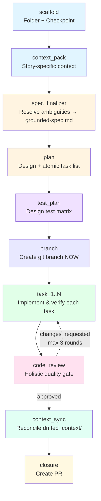

# 🔄 Pipeline Overview

Understanding ARCUS's Spec → Code → PR workflow

---

## The Pipeline at a Glance

ARCUS runs an ordered list of stages. The keys (in order) are:

```
scaffold → context_pack → spec_finalizer → plan → test_plan
        → branch → task_1..N → code_review → context_sync → closure
```



> **Heads up — the branch is created late.** `scaffold` records the *planned* branch
> name in the checkpoint but does **not** create any git branch. The real git branch is
> created at the **start of Implementation** by the `branch` stage. See
> ["Deferred branch creation"](#deferred-branch-creation) below.

---

## The Capability Library (Three Tiers)

ARCUS is built as a **three-tier capability library** — a modular architecture where each component has a clear role:

### Capability (Atomic, Plug-n-Play)
**Stateless building blocks** that do one thing well. Declared inputs → one output. No checkpoint/branch operations. Usable **standalone** by any developer, even outside ARCUS — contracts use domain names like `implementation_plan`, `spec_grounding`, `change_set`, not ARCUS-specific filenames.

**Examples:**
- `spec-finalizer` — Resolve ambiguities in a story
- `implementation-planner` — Design technical approach and decompose into tasks
- `context-pack-builder` — Build story-specific context pack
- `test-spec-compiler` — Design test matrix
- `spec-compliance-reviewer` — Verify implementation matches spec
- `code-quality-reviewer` — Review for maintainability
- `security-reviewer` — Security vulnerability analysis
- `performance-reviewer` — Performance regression detection
- `simplify-and-verify` — Refactor gate + verification

### Coordinator (Stateless Sequencer)
**Thin orchestrators** that sequence multiple capabilities without managing pipeline state. They compose capabilities into higher-order workflows but remain stateless.

**Examples:**
- `kick-off` — Run context-pack-builder → spec-finalizer (brainstorm/planning only, no implementation)
- `code-reviewer` — Dispatch specialist reviewers + consolidate findings
- `code-simplifier` — Simplify code and verify changes
- `repo-agentifier` — Build repository context artifacts

### Orchestrator (Stateful Pipeline Driver)
**Owns checkpoint, branch, and handoff gate state.** Drives the full lifecycle from story to PR, managing the session and stage transitions.

**Examples:**
- `arcus-controller` — The single orchestrator for **both interactive and autonomous modes**
- `implementation-runner` — Per-task implementation loop
- `subagent-task-dispatcher` — Isolated task dispatch protocol

This three-tier design keeps ARCUS **composable** — capabilities can be reused in any context, coordinators can mix-and-match capabilities, and only orchestrators carry session state.

---

## Two Modes: Interactive vs Autonomous

ARCUS ships **two ways to run the same pipeline** via the **`arcus-controller`** orchestrator:

- **Interactive (default)** — The `arcus-controller` pauses at handoff gates for review. You stay in control, reviewing each stage's output and saying "yes"/"proceed" to advance. Trigger with `implement <STORY>` or `plan <STORY>`.

- **Autonomous (afk)** — The `arcus-controller` runs all stages unattended, back-to-back with milestone-only output. Activates on AFK phrases: `afk`, `forge`, `run afk on <STORY>`.

Both modes use the same orchestrator (`arcus-controller`), the same stages, and the same capabilities — the only difference is whether handoff gates pause for user review.

See **"interactive or autonomous?"** for guidance on choosing.

---

## Stage Breakdown

### scaffold 🔧

**Purpose:** Create the story workspace and pipeline state — *without* creating a branch.

**What happens:**
- `scaffold.sh` creates `.arcus/specs/[STORY-ID]/`
- Copies the story file into the workspace as `story.md`
- Initializes `session-checkpoint.json`, **recording the planned `branch_name` and
  `base_branch`** for later
- Creates **no git branch** (deferred to the `branch` stage)

**Driven by:**
- Interactive: `arcus-controller` (interactive mode) calls `scaffold.sh`
- Autonomous: `arcus-controller` (autonomous mode) calls `scaffold.sh`

**Artifacts created:**
- `.arcus/specs/[STORY-ID]/story.md` (copy of original)
- `.arcus/session-checkpoint.json` (state tracking, with planned branch info)

**Duration:** < 1 minute (deterministic)

---

### context_pack 📚

**Purpose:** Build a minimal, story-specific context bundle from the shared `.context/`
snapshot.

**Skills invoked:**
- `context-pack-builder`

**Artifacts created:**
- `context-pack.md` — relevant flows, likely working areas, related patterns

**Duration:** 1-3 minutes

---

### spec_finalizer 💡

**Purpose:** Resolve ambiguities and document technical decisions before planning.

**What happens:**
- Analyzes the story for completeness and identifies ambiguous requirements
- **Interactive mode:** dialogue with recommendations. **Every interview question is presented with
  exactly one option marked Recommended (with a one-line rationale) plus a custom-answer
  option** — so you can accept the recommendation fast or steer.
- **Autonomous mode:** auto-resolves ambiguities one-shot, grounded in repo patterns
- Consolidates all grounded story decisions into a single **`grounded-spec.md`**

**Skills invoked:**
- `spec-finalizer`

**Artifacts created:**
- `grounded-spec.md` — grounded story decisions (context grounding, resolved ambiguities,
  dialogue answers, implementation boundary, guardrail check). *Written by spec-finalizer;
  the design deliberation and task list live separately in `plan.md`.*

**💡 Tip:** This is your chance to course-correct before implementation. Review `grounded-spec.md`
carefully!

---

### plan 🗂️

**Purpose:** Design the technical approach and decompose the story into atomic implementation tasks.

**What happens:**
- Acts as a Tech Lead: designs the technical approach and breaks the story into
  atomic tasks with a Definition of Done
- **Interactive mode:** the `implementation-planner` runs the same recommendation-first
  interview style — every question carries one **Recommended** option + rationale and a
  custom-answer option
- Writes the **design deliberation + machine-parsed task list** to `plan.md`

**Skills invoked:**
- `implementation-planner`

**Artifacts created:**
- `plan.md` — design deliberation plus the atomic task list with IDs, complexity, affected files, Definition of Done

---

### test_plan 🧪

**Purpose:** Design a comprehensive test matrix before writing code (TDD).

**What happens:**
- Reviews `plan.md` and `grounded-spec.md`
- Designs test cases across **Functional / Edge Case / Error Handling**
- Maps each test to a `plan.md` task ID
- Follows patterns from `.context/testing-patterns.md`

**Skills invoked:**
- `test-spec-compiler`

**Artifacts created:**
- `test-plan.md` — test matrix

**💡 Tip:** Add missing test cases to `test-plan.md` before proceeding.

---

### branch 🌿

**Purpose:** Create the git feature branch — *now*, at the start of Implementation.

**What happens:**
- `branch.sh` (driven by the `implementation-runner` skill) creates the git branch
  `arcus/[STORY-ID]` using the name planned during `scaffold`
- **Bumps on collision** if a branch with that name already exists
- If the final name differs from the planned name, calls
  `checkpoint.sh set-branch` to record the actual name

**Driven by:**
- `implementation-runner` (used by both interactive and autonomous modes)

**Why deferred?** Planning never touches git. The branch is only created once you commit
to writing code, keeping aborted/abandoned plans from littering your branch list.

---

### task_1..N ⚙️ (Implementation)

**Purpose:** Implement the story task-by-task with continuous verification.

**What happens:**
- The `implementation-runner` drives the per-task loop (the same loop is reused by
  both interactive and autonomous modes)
- Each task is dispatched to an isolated subagent with scoped context
- Each task includes implementation, test writing (following `test-plan.md`), a refactor
  gate (`simplify-and-verify` capability: mutate toward simplicity, re-run suite — skipped on `light`
  tasks), and one lightweight, **advisory** per-task spec-compliance check (does not
  hard-block; unresolved issues carry forward to Code Review)
- Commits incrementally (one commit per task) and runs tests after each task

> **Note:** Quality is *not* reviewed per-task. Code quality is owned holistically by the
> `code_review` stage over the whole branch diff — reviewing it per-task is redundant
> because isolated subagents never see prior tasks' code.

**Skills invoked:**
- `implementation-runner` (orchestrator: loop driver)
- `subagent-task-dispatcher` (orchestrator: per-task dispatch protocol)
- `simplify-and-verify` (capability: per-task refactor gate, skipped on `light`)
- `spec-compliance-reviewer` (capability: per-task mode, advisory)

**Artifacts created:**
- Code changes + tests (committed to the branch)

---

### code_review 🔍

**Purpose:** The real last gate before a PR. Runs over the **full branch diff** in two
tiers, with a zero-trust persona — brutal in the hunt (assume the code is guilty, verify
every claim by reading source and running tools), fair in the verdict (only genuine,
concrete problems block).

**What happens:**

**Tier 1 — Deterministic Gate (runs the repo's real tooling, fails fast):**
- Executes the actual commands CI would run over the integrated branch — never simulated
  by eyeballing the diff. Resolved from CI workflows first, then `.context/` tables.
  - **Typecheck / compile**
  - **Full test suite** (per-task green ≠ whole-branch green)
  - **Build + startup smoke**
  - **Secret scan**
  - **Lint & format** (auto-fixed and committed where a fix mode exists)
  - **Static analysis** (findings feed the semantic tier)
- Any hard block (typecheck / tests / build / secret) → skips the semantic fan-out and
  returns `changes_requested` immediately. Unresolvable commands are honestly recorded as
  `skipped: not configured`.

**Tier 2 — Semantic Review (only if the gate passes):**
- Fans out to specialist reviewers for judgment-grade concerns no tool can answer:
  - **Spec compliance** (holistic): Does it meet all requirements?
  - **Code quality** (holistic): Clean structure, maintainability, **cognitive
    complexity**, and **test proportionality** (over-engineered/slow tests that bloat the
    build)?
  - **Security**: Any exploitable vulnerabilities?
  - **Performance**: Any concrete regressions?
  - **History/Context**: Any load-bearing complexity removed, silently-reverted fixes, or re-added previously-reverted code? (skipped on docs-only diffs and shallow history)
- Consolidates findings, deduplicates, filters noise, assigns severity:
  - **critical** — Blocks merge (outage, data loss, security breach)
  - **warning** — Concrete issue (performance hit, maintainability concern)
  - **suggestion** — Minor nit (non-blocking)
- Returns verdict: `approved` or `changes_requested`

**Skills invoked:**
- `code-reviewer` (coordinator: orchestrates specialist reviewers)
- `review-consolidator` (capability: deduplicates + judges severity)
- `spec-compliance-reviewer` (capability: holistic mode)
- `code-quality-reviewer` (capability: holistic mode)
- `security-reviewer` (capability)
- `performance-reviewer` (capability)
- `history-context-reviewer` (capability)

**Artifacts created:**
- `review.md` — Deterministic gate results (pass/fail/skipped per check) + consolidated
  semantic findings with verdict

**💡 Tip:** If you disagree with the semantic findings, you can proceed anyway (override
verdict). Tier 1 (deterministic) failures are objective and can't be overridden by
judgment.

---

### context_sync 🔁

**Purpose:** After Code Review approves, reconcile the shared `.context/` artifacts that the
approved branch diff materially drifted — *before* the PR is opened.

**What happens:**
- Strictly assesses whether the approved branch diff materially changed any `.context/` artifact
  (business flows, `repo_map.md`, `repo_scope.md`, `testing-patterns.md`, `design-and-coding-patterns.md`)
- Surgically syncs **only the affected** artifacts (refreshing their context-meta); updates
  `AGENTS.md` only when a flow file is added or removed
- **Facts-only and diff-driven** — no full repository rescan
- **Interactive mode:** shows a drift assessment + a single consolidated yes/no
- **Autonomous mode:** auto-decides
- Also **standalone-invocable** via `sync context for <STORY_ID>` / `sync context`

**Skills invoked:**
- `context-drift-sync` (capability)

**Artifacts created:**
- **None** — updates existing `.context/` files in place; the rationale is persisted in the sync
  commit body (no new artifact, no `plan.md` subsection)

**Handoff:** No user decision gate — auto-continues to `closure` once the reconciliation is decided.

> See the **`context-engineering.md`** guide module for how the five shared `.context/` artifacts are
> built once, scoped per story, and synced on drift.

---

### closure 🎯

**Purpose:** Create the pull request with evidence and context.

**What happens:**
- Runs the final test suite, gathers evidence of completion
- Synthesizes the PR description from: original story, `grounded-spec.md`, `plan.md`, test
  results, and review findings
- Creates the pull request (if `gh` CLI configured)

**Skills invoked:**
- `pull-request-builder` (capability)

**Artifacts created:**
- `PR_DESCRIPTION.md` — Final PR body

**Terminal stage:** PR created or ready for manual creation.

---

## Review Loopback Mechanism

If `code_review` returns `changes_requested`:

1. **Fix-tasks generated** from review findings
2. **Loop back into the task loop** (Implementation)
3. **Subagents address issues** following the fix-tasks
4. **Return to `code_review`** for re-review
5. **Bounded to 3 rounds maximum** to prevent infinite loops
6. **Manual intervention** required if the 3rd round still fails

**Why bounded?** Prevents loops on subjective or unclear issues. After 3 rounds, human
judgment is needed.

---

## Interactive vs Autonomous Behavior

| Aspect | Interactive (default) | Autonomous (afk) |
|--------|----------------------|------------------|
| **Driver** | `arcus-controller` in interactive mode | `arcus-controller` in autonomous mode |
| **Gates** | Pauses between stages for your "yes"/"proceed" | Auto-confirms; runs back-to-back |
| **spec_finalizer** | Recommendation-first dialogue (one question at a time) | One-shot auto-resolution |
| **Resume** | Cold resume = the next stage's explicit phrase + the checkpoint | Intended to run uninterrupted |
| **Output** | Full progress updates | Milestone-only output |

> Both modes use the same **`arcus-controller`** orchestrator — the only difference is whether
> handoff gates pause for user review.

---

## Interactive Mode Resume Phrases

In interactive mode, the orchestrator tells you the exact phrase to resume the next
stage in a fresh session. Examples:

| To run / resume… | Say |
|------------------|-----|
| Full pipeline | `implement <STORY>` (or `plan <STORY>`) |
| Test plan | `generate test plan for <STORY>` |
| Code review | `review <STORY>` |
| Context sync | `sync context for <STORY>` |
| Closure (PR) | `create pull request for <STORY>` |

Within the same session, a simple `yes` / `proceed` loads the next stage directly.

---

## What's Next?

- **Understand modes:** Ask "interactive or autonomous?"
- **See all commands:** Ask "command reference"
- **Check artifacts:** Ask "explain artifacts"
- **Get help:** Ask "troubleshooting"
