# 🔄 Pipeline Overview

Understanding ARCUS's 6-stage SDLC workflow

---

## The Pipeline at a Glance

```mermaid
graph LR
    Init[0️⃣ Init<br/>Branch & Workspace] -->|GATE 0| Brainstorm[1️⃣ Brainstorm<br/>Resolve Ambiguities]
    Brainstorm -->|GATE A| TestPlan[2️⃣ Test Plan<br/>Design Test Matrix]
    TestPlan -->|GATE B| Code[3️⃣ Code<br/>Implement & Verify]
    Code -->|GATE C| Review[4️⃣ Review<br/>Holistic Quality Check]
    Review -->|GATE D<br/>approved| Closure[5️⃣ Closure<br/>Create PR]
    Review -.->|changes_requested<br/>max 3 rounds| Code
    
    style Init fill:#e1f5ff
    style Brainstorm fill:#fff4e1
    style TestPlan fill:#f0e1ff
    style Code fill:#e1ffe8
    style Review fill:#ffe1f0
    style Closure fill:#fff9e1
```

---

## Stage Breakdown

### Stage 0: Init 🔧

**Purpose:** Set up workspace and prepare for development

**What happens:**
- Creates feature branch: `arcus/[STORY-ID]`
- Scaffolds `.arcus/specs/[STORY-ID]/` directory
- Copies story file to workspace
- Initializes `session-checkpoint.json` (pipeline state tracker)

**Skills invoked:**
- `branch-initializer`

**Artifacts created:**
- `.arcus/specs/[STORY-ID]/story.md` (copy of original)
- `.arcus/session-checkpoint.json` (state tracking)
- Git branch `arcus/[STORY-ID]`

**Handoff Gate 0:** Implicit in gated mode (setup complete)

**What to check:**
- Branch created successfully
- Story copied correctly to workspace
- Ready to proceed

**Duration:** < 1 minute (deterministic)

---

### Stage 1: Brainstorm 💡

**Purpose:** Resolve ambiguities and document technical decisions

**What happens:**
- Analyzes story for completeness
- Identifies ambiguous requirements
- **Gated mode:** Asks clarifying questions one-by-one (dialogue)
- **AFK mode:** Auto-resolves ambiguities (one-shot)
- Documents assumptions and constraints
- Optionally builds story-specific context pack

**Skills invoked:**
- `spec-finalizer` (dialogue mode or one-shot)
- `context-pack-builder` (optional, for story-specific context)

**Artifacts created:**
- `assumptions.md` — Technical decisions, constraints, error handling
- `clarifications.md` — User answers (gated mode only)
- `context-pack.md` — Story-specific context (optional)

**Handoff Gate A:** "Assumptions documented, ready for planning?"

**What to check:**
- Assumptions align with your intent
- No missing technical constraints
- Error handling approach makes sense
- Architecture decisions are correct

**Duration:** 5-15 minutes (gated), faster in AFK

**💡 Tip:** This is your chance to course-correct before implementation. Review assumptions carefully!

---

### Stage 2: Test Plan 🧪

**Purpose:** Design comprehensive test matrix before writing code

**What happens:**
- Reviews blueprint and assumptions
- Designs test cases across three categories:
  - **Functional:** Happy path verification
  - **Edge Case:** Boundary conditions, null handling
  - **Error Handling:** Validation failures, exception paths
- Maps each test to blueprint task IDs
- Follows patterns from `.context/testing-patterns.md`

**Skills invoked:**
- `test-spec-compiler`

**Artifacts created:**
- `test-plan.md` — Test matrix with functional/edge/error categories

**Handoff Gate B:** "Test plan complete, ready to implement?"

**What to check:**
- Test coverage feels comprehensive
- Edge cases captured
- Error scenarios realistic
- Test structure follows repo patterns

**Duration:** 5-10 minutes

**💡 Tip:** Add missing test cases to `test-plan.md` before proceeding. This is TDD in action!

---

### Stage 3: Code ⚙️

**Purpose:** Implement the story with continuous verification

**What happens:**
- Generates implementation blueprint (atomic tasks)
- Dispatches each task to isolated subagent
- Each task includes:
  - Implementation
  - Test writing (following test-plan.md)
  - Per-task compliance review
  - Per-task quality review
- Commits code incrementally (one commit per task)
- Runs tests after each task

**Skills invoked:**
- `implementation-planner` (generates blueprint)
- `subagent-task-dispatcher` (orchestrates task execution)
- `spec-compliance-reviewer` (per-task mode)
- `code-quality-reviewer` (per-task mode)

**Artifacts created:**
- `blueprint.md` — Implementation plan with atomic tasks
- Code changes (committed to branch)
- Tests (committed alongside code)

**Handoff Gate C:** "All tasks complete, tests passing, ready for holistic review?"

**What to check:**
- All tests pass locally
- Implementation feels complete
- No obvious gaps or missing features
- Commits are clean and atomic

**Duration:** 15-60 minutes (depends on complexity)

**💡 Tip:** You can edit `blueprint.md` at Gate B if you disagree with the task breakdown.

---

### Stage 4: Review 🔍

**Purpose:** Holistic quality check across all changes

**What happens:**
- Reviews **full branch diff** (not individual tasks)
- Runs multiple review perspectives:
  - **Spec compliance** (holistic): Does it meet all requirements?
  - **Code quality** (holistic): Clean structure, maintainability?
  - **Security**: Any exploitable vulnerabilities?
  - **Performance**: Any concrete regressions?
- Consolidates findings
- Deduplicates and filters noise
- Assigns severity levels:
  - **critical** — Blocks merge (outage, data loss, security breach)
  - **warning** — Concrete issue (performance hit, maintainability concern)
  - **suggestion** — Minor nit (non-blocking)
- Returns verdict: `approved` or `changes_requested`

**Skills invoked:**
- `code-reviewer` (coordinator)
- `spec-compliance-reviewer` (holistic mode)
- `code-quality-reviewer` (holistic mode)
- `security-reviewer`
- `performance-reviewer`

**Artifacts created:**
- `review.md` — Consolidated findings with verdict

**Handoff Gate D:**
- **If approved:** "Review passed, ready to create PR?"
- **If changes_requested:** "Issues found, fix and re-review? (Auto-loops up to 3 rounds)"

**What to check:**
- Review findings are accurate
- Severity levels appropriate
- No false positives
- Critical issues are genuine blockers

**Duration:** 5-15 minutes

**💡 Tip:** If you disagree with findings, you can proceed anyway (override verdict).

---

### Stage 5: Closure 🎯

**Purpose:** Create pull request with evidence and context

**What happens:**
- Runs final test suite
- Gathers evidence of completion
- Synthesizes PR description from:
  - Original story
  - Assumptions
  - Blueprint
  - Test results
  - Review findings
- Creates pull request (if `gh` CLI configured)

**Skills invoked:**
- `pull-request-builder`

**Artifacts created:**
- `PR_DESCRIPTION.md` — Final PR body

**Terminal stage:** PR created or ready for manual creation

**What to check:**
- PR description is accurate and complete
- All tests pass
- Branch is up to date with base

**Duration:** 2-5 minutes

---

## Review Loopback Mechanism

If Stage 4 returns `changes_requested`:

1. **Fix-tasks generated** from review findings
2. **Loop back to Stage 3** (Code)
3. **Subagents address issues** following fix-tasks
4. **Return to Stage 4** for re-review
5. **Bounded to 3 rounds maximum** to prevent infinite loops
6. **Manual intervention** required if 3rd round still fails

**Why bounded?** Prevents loops on subjective or unclear issues. After 3 rounds, human judgment needed.

---

## Gated vs AFK Behavior

| Aspect | Gated Mode | AFK Mode |
|--------|------------|----------|
| **Gates** | Pauses at 5 handoff points | Auto-confirms all gates |
| **Brainstorm** | Interactive dialogue (one question at a time) | One-shot auto-resolution |
| **User Role** | Review and approve at each gate | Hands-off until completion |
| **Session** | Can pause/resume across days | Single uninterrupted session |
| **Output** | Full progress updates | Milestone-only output |

---

## Quick Stage Reference

| Stage | Entry Command | Exit Condition | Duration |
|-------|---------------|----------------|----------|
| 0: Init | `implement story.md` | Workspace ready | < 1 min |
| 1: Brainstorm | Auto or `brainstorm story` | `assumptions.md` complete | 5-15 min |
| 2: Test Plan | Auto or `generate tests story` | `test-plan.md` complete | 5-10 min |
| 3: Code | Auto or `code story` | All tasks done, tests pass | 15-60 min |
| 4: Review | Auto or `review story` | Verdict: approved/changes | 5-15 min |
| 5: Closure | Auto or `close story` | PR created | 2-5 min |

**Total time (gated):** 30-90 minutes active time, spread over hours/days  
**Total time (AFK):** 30-90 minutes uninterrupted

---

## What's Next?

- **Understand modes:** Ask "gated or afk?"
- **See all commands:** Ask "command reference"
- **Check artifacts:** Ask "explain artifacts"
- **Get help:** Ask "troubleshooting"
