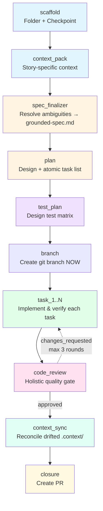

# 🔄 Pipeline Overview

Understanding ARCUS's Spec → Code → PR workflow

---

## The Pipeline at a Glance

ARCUS runs an ordered list of stages. The keys (in order) are:

```
scaffold → context_pack → spec_finalizer → plan → test_plan
        → branch → task_1..N → code_review → context_sync → closure
```


```mermaid
graph TD
    Scaffold[scaffold<br/>Folder + Checkpoint] --> ContextPack[context_pack<br/>Story-specific context]
    ContextPack --> SpecFinalizer[spec_finalizer<br/>Resolve ambiguities → grounded-spec.md]
    SpecFinalizer --> Plan[plan<br/>Design + atomic task list]
    Plan --> TestPlan[test_plan<br/>Design test matrix]
    TestPlan --> Branch[branch<br/>Create git branch NOW]
    Branch --> Tasks[task_1..N<br/>Implement & verify each task]
    Tasks --> CodeReview[code_review<br/>Holistic quality gate]
    CodeReview -->|approved| ContextSync[context_sync<br/>Reconcile drifted .context/]
    ContextSync --> Closure[closure<br/>Create PR]
    CodeReview -.->|changes_requested<br/>max 3 rounds| Tasks

    style Scaffold fill:#e1f5ff
    style ContextPack fill:#e1f5ff
    style SpecFinalizer fill:#fff4e1
    style Plan fill:#fff4e1
    style TestPlan fill:#f0e1ff
    style Branch fill:#e8e8ff
    style Tasks fill:#e1ffe8
    style CodeReview fill:#ffe1f0
    style ContextSync fill:#e1fff4
    style Closure fill:#fff9e1
```

> **Heads up — the branch is created late.** `scaffold` records the *planned* branch
> name in the checkpoint but does **not** create any git branch. The real git branch is
> created at the **start of Implementation** by the `branch` stage. See
> ["Deferred branch creation"](#deferred-branch-creation) below.

---

## The Capability Library (Three Tiers)

ARCUS is built as a **three-tier capability library** — a modular architecture where each component has a clear role:

### Capability (Atomic, Plug-n-Play)
**Stateless building blocks** that do one thing well. Declared inputs → one output. No checkpoint/branch operations. Usable **standalone** by any developer, even outside ARCUS — contracts use domain names like `implementation_plan`, `spec_grounding`, `change_set`, not ARCUS-specific filenames.

**Examples:**
- `spec-finalizer` — Resolve ambiguities in a story
- `implementation-planner` — Design technical approach and decompose into tasks
- `context-pack-builder` — Build story-specific context pack
- `test-spec-compiler` — Design test matrix
- `spec-compliance-reviewer` — Verify implementation matches spec
- `code-quality-reviewer` — Review for maintainability
- `security-reviewer` — Security vulnerability analysis
- `performance-reviewer` — Performance regression detection
- `simplify-and-verify` — Refactor gate + verification

### Coordinator (Stateless Sequencer)
**Thin orchestrators** that sequence multiple capabilities without managing pipeline state. They compose capabilities into higher-order workflows but remain stateless.

**Examples:**
- `code-reviewer` — Dispatch specialist reviewers + consolidate findings
- `repo-agentifier` — Build repository context artifacts

### Orchestrator (Stateful Pipeline Driver)
**Owns checkpoint and branch state.** Drives the full lifecycle from story to PR, managing the session and stage transitions.

**Examples:**
- `arcus-controller` — The single orchestrator for **all three modes** (`afk`, `intelligent`, `gated`)
- `implementation-runner` — Per-task implementation loop
- `subagent-task-dispatcher` — Isolated task dispatch protocol

This three-tier design keeps ARCUS **composable** — capabilities can be reused in any context, coordinators can mix-and-match capabilities, and only orchestrators carry session state.

---

## Three Modes, One Pipeline

ARCUS ships **three ways to run the same pipeline** via the **`arcus-controller`** orchestrator —
they differ only in **whether, and where, the pipeline pauses for a human**:

- **`gated` (default)** — everything `intelligent` does, **plus** configurable phase-boundary
  stops (see **`.arcus/config.json`** below). Trigger with `arcus <STORY>` (the default) or
  `plan <STORY>`.
- **`intelligent`** — stops only for a genuine open question raised during Brainstorm; no
  phase-boundary gates ever fire. This is **cloud's default behavior** (every ARCUS cloud/CI run is
  scaffolded with `--mode intelligent`). Trigger locally with `arcus <STORY> --intelligent`.
- **`afk` (autonomous)** — runs all stages unattended, back-to-back with milestone-only output.
  Activates on AFK phrases: `afk <STORY>`, `forge <STORY>`, `run afk on <STORY>`, or
  `arcus <STORY> --afk`.

All three modes use the same orchestrator (`arcus-controller`), the same stages, and the same
capabilities — the only differences are whether the Brainstorm open questions are surfaced to you,
and whether (for `gated`) the pipeline also pauses at phase boundaries.

### `.arcus/config.json`: narrowing `gated`'s phase-boundary stops

`gated` mode's phase-boundary gates default to pausing after **all three** transitions — Test Plan
→ Implementation, Implementation → Code Review, Code Review → Context Sync. To pause after fewer of
them, create an optional, developer-authored, **gitignored** `.arcus/config.json` at the repo root
**before** scaffolding a `gated` story:

```json
{ "stop_after": ["test_plan", "implementation", "code_review"] }
```

The three valid keys are `test_plan`, `implementation`, `code_review`. It only ever **narrows**
that default set (an unordered set — it never reorders the fixed pipeline sequence, and never adds
a fourth gate). It's opt-in (no script creates it), read **once at scaffold time** for `gated` mode
only (never on `resume <STORY>`, never for `intelligent`/`afk`), and invalid content (malformed
JSON, non-array, unknown keys, duplicates) never hard-fails a scaffold — it warns and falls back or
drops the bad entries.

See **"modes explained"** for the full decision guide on choosing between the three.

---

## Stage Breakdown

### scaffold 🔧

**Purpose:** Create the story workspace and pipeline state — *without* creating a branch.

**What happens:**
- `scaffold.sh` creates `.arcus/specs/[STORY-ID]/`
- Copies the story file into the workspace as `story.md`
- Initializes `session-checkpoint.json`, **recording the planned `branch_name` and
  `base_branch`** for later
- Creates **no git branch** (deferred to the `branch` stage)

**Driven by:**
- `arcus-controller` calls `scaffold.sh` identically in all three modes (`gated`, `intelligent`, `afk`)

**Artifacts created:**
- `.arcus/specs/[STORY-ID]/story.md` (copy of original)
- `.arcus/session-checkpoint.json` (state tracking, with planned branch info)

**Duration:** < 1 minute (deterministic)

---

### context_pack 📚

**Purpose:** Build a minimal, story-specific context bundle from the shared `.context/`
snapshot.

**Skills invoked:**
- `context-pack-builder`

**Artifacts created:**
- `context-pack.md` — relevant flows, likely working areas, related patterns

**Duration:** 1-3 minutes

---

### spec_finalizer 💡

**Purpose:** Resolve ambiguities and document technical decisions before planning.

**What happens:**
- Analyzes the story for completeness and identifies ambiguous requirements
- **Always** auto-resolves every ambiguity one-shot, grounded in repo patterns — the spec is fully
  resolved on every run, in all three modes
- **Also** records what it was least confident about in an `## Open Questions` block. **Every entry
  presents exactly one option marked Recommended (with a one-line rationale)** and you can always
  answer in your own words.
- **`gated` and `intelligent`:** the orchestrator shows you that block — **all questions at once** —
  and folds your reply back in. **`afk`:** the block is recorded but never surfaced.
- Consolidates all grounded story decisions into a single **`grounded-spec.md`**

**Skills invoked:**
- `spec-finalizer`

**Artifacts created:**
- `grounded-spec.md` — grounded story decisions (context grounding, resolved ambiguities,
  dialogue answers, implementation boundary, guardrail check). *Written by spec-finalizer;
  the design deliberation and task list live separately in `plan.md`.*

**💡 Tip:** This is your chance to course-correct before implementation. Review `grounded-spec.md`
carefully!

---

### plan 🗂️

**Purpose:** Design the technical approach and decompose the story into atomic implementation tasks.

**What happens:**
- Acts as a Tech Lead: designs the technical approach and breaks the story into
  atomic tasks with a Definition of Done
- `implementation-planner` follows the same pattern: it always picks an approach, and records the
  choice as an `## Open Questions` entry **only** when it is close-run or hard to reverse — one
  **Recommended** option + rationale, and you can propose your own
- Writes the **design deliberation + machine-parsed task list** to `plan.md`

**Skills invoked:**
- `implementation-planner`

**Artifacts created:**
- `plan.md` — design deliberation plus the atomic task list with IDs, complexity, affected files, Definition of Done

---

### test_plan 🧪

**Purpose:** Design a comprehensive test matrix before writing code (TDD).

**What happens:**
- Reviews `plan.md` and `grounded-spec.md`
- Designs test cases across **Functional / Edge Case / Error Handling**
- Maps each test to a `plan.md` task ID
- Follows patterns from `.context/testing-patterns.md`

**Skills invoked:**
- `test-spec-compiler`

**Artifacts created:**
- `test-plan.md` — test matrix

**💡 Tip:** Add missing test cases to `test-plan.md` before proceeding.

---

### branch 🌿

**Purpose:** Create the git feature branch — *now*, at the start of Implementation.

**What happens:**
- `branch.sh` (driven by the `implementation-runner` skill) creates the git branch
  `arcus/[STORY-ID]` using the name planned during `scaffold`
- **Bumps on collision** if a branch with that name already exists
- If the final name differs from the planned name, calls
  `checkpoint.sh set-branch` to record the actual name

**Driven by:**
- `implementation-runner` (used identically by all three modes)

**Why deferred?** Planning never touches git. The branch is only created once you commit
to writing code, keeping aborted/abandoned plans from littering your branch list.

---

### task_1..N ⚙️ (Implementation)

**Purpose:** Implement the story task-by-task with continuous verification.

**What happens:**
- The `implementation-runner` drives the per-task loop (the same loop is reused identically by
  all three modes)
- Each task is dispatched to an isolated subagent with scoped context
- Each task includes implementation, test writing (following `test-plan.md`), a refactor
  gate (`simplify-and-verify` capability: mutate toward simplicity, re-run suite — skipped on `light`
  tasks), and one lightweight, **advisory** per-task spec-compliance check (does not
  hard-block; unresolved issues carry forward to Code Review)
- Commits incrementally (one commit per task) and runs tests after each task

> **Note:** Quality is *not* reviewed per-task. Code quality is owned holistically by the
> `code_review` stage over the whole branch diff — reviewing it per-task is redundant
> because isolated subagents never see prior tasks' code.

**Skills invoked:**
- `implementation-runner` (orchestrator: loop driver)
- `subagent-task-dispatcher` (orchestrator: per-task dispatch protocol)
- `simplify-and-verify` (capability: per-task refactor gate, skipped on `light`)
- `spec-compliance-reviewer` (capability: per-task mode, advisory)

**Artifacts created:**
- Code changes + tests (committed to the branch)

---

### code_review 🔍

**Purpose:** The real last gate before a PR. Runs over the **full branch diff** in two
tiers, with a zero-trust persona — brutal in the hunt (assume the code is guilty, verify
every claim by reading source and running tools), fair in the verdict (only genuine,
concrete problems block).

**What happens:**

**Tier 1 — Deterministic Gate (runs the repo's real tooling, fails fast):**
- Executes the actual commands CI would run over the integrated branch — never simulated
  by eyeballing the diff. Resolved from CI workflows first, then `.context/` tables.
  - **Typecheck / compile**
  - **Full test suite** (per-task green ≠ whole-branch green)
  - **Build + startup smoke**
  - **Secret scan**
  - **Lint & format** (auto-fixed and committed where a fix mode exists)
  - **Static analysis** (findings feed the semantic tier)
- Any hard block (typecheck / tests / build / secret) → skips the semantic fan-out and
  returns `changes_requested` immediately. Unresolvable commands are honestly recorded as
  `skipped: not configured`.

**Tier 2 — Semantic Review (only if the gate passes):**
- Fans out to specialist reviewers for judgment-grade concerns no tool can answer:
  - **Spec compliance** (holistic): Does it meet all requirements?
  - **Code quality** (holistic): Clean structure, maintainability, **cognitive
    complexity**, and **test proportionality** (over-engineered/slow tests that bloat the
    build)?
  - **Security**: Any exploitable vulnerabilities?
  - **Performance**: Any concrete regressions?
  - **History/Context**: Any load-bearing complexity removed, silently-reverted fixes, or re-added previously-reverted code? (skipped on docs-only diffs and shallow history)
- Consolidates findings, deduplicates, filters noise, assigns severity:
  - **critical** — Blocks merge (outage, data loss, security breach)
  - **warning** — Concrete issue (performance hit, maintainability concern)
  - **suggestion** — Minor nit (non-blocking)
- Returns verdict: `approved` or `changes_requested`

**Skills invoked:**
- `code-reviewer` (coordinator: orchestrates specialist reviewers)
- `review-consolidator` (capability: deduplicates + judges severity)
- `spec-compliance-reviewer` (capability: holistic mode)
- `code-quality-reviewer` (capability: holistic mode)
- `security-reviewer` (capability)
- `performance-reviewer` (capability)
- `history-context-reviewer` (capability)

**Artifacts created:**
- `review.md` — Deterministic gate results (pass/fail/skipped per check) + consolidated
  semantic findings with verdict

**💡 Tip:** If you disagree with the semantic findings, you can proceed anyway (override
verdict). Tier 1 (deterministic) failures are objective and can't be overridden by
judgment.

---

### context_sync 🔁

**Purpose:** After Code Review approves, reconcile the shared `.context/` artifacts that the
approved branch diff materially drifted — *before* the PR is opened.

**What happens:**
- Strictly assesses whether the approved branch diff materially changed any `.context/` artifact
  (business flows, `repo_map.md`, `repo_scope.md`, `testing-patterns.md`, `design-and-coding-patterns.md`)
- Surgically syncs **only the affected** artifacts (refreshing their context-meta); updates
  `AGENTS.md` only when a flow file is added or removed
- **Facts-only and diff-driven** — no full repository rescan
- Runs automatically (`apply_mode=auto`) in **all three modes** — no user decision gate here. Any
  `gated`-mode pause for this transition already happened one step earlier, at the Code Review →
  Context Sync phase boundary (see **`.arcus/config.json`** above)
- Resume the in-pipeline stage with `resume <STORY_ID>` (the controller picks up here); run an
  ad-hoc full sweep with `sync context`

**Skills invoked:**
- `context-drift-sync` (capability)

**Artifacts created:**
- **None** — updates existing `.context/` files in place; the rationale is persisted in the sync
  commit body (no new artifact, no `plan.md` subsection)

**Handoff:** No user decision gate — auto-continues to `closure` once the reconciliation is decided.

> See the **`context-engineering.md`** guide module for how the five shared `.context/` artifacts are
> built once, scoped per story, and synced on drift.

---

### closure 🎯

**Purpose:** Create the pull request with evidence and context.

**What happens:**
- Runs the final test suite, gathers evidence of completion
- Synthesizes the PR description from: original story, `grounded-spec.md`, `plan.md`, test
  results, and review findings
- Creates the pull request (if `gh` CLI configured)

**Skills invoked:**
- `pull-request-builder` (capability)

**Artifacts created:**
- `PR_DESCRIPTION.md` — Final PR body

**Terminal stage:** PR created or ready for manual creation.

---

## Review Loopback Mechanism

If `code_review` returns `changes_requested`:

1. **Fix-tasks generated** from review findings
2. **Loop back into the task loop** (Implementation)
3. **Subagents address issues** following the fix-tasks
4. **Return to `code_review`** for re-review
5. **Bounded to 3 rounds maximum** to prevent infinite loops
6. **Manual intervention** required if the 3rd round still fails

**Why bounded?** Prevents loops on subjective or unclear issues. After 3 rounds, human
judgment is needed.

---

## Mode Behavior at a Glance

| Aspect | `gated` (Default) | `intelligent` | `afk` (Autonomous) |
|--------|----------------------|------------------|------------------|
| **Driver** | `arcus-controller` | `arcus-controller` | `arcus-controller` |
| **Open-question gate** | Pauses once, for the Brainstorm open questions | Pauses once, for the Brainstorm open questions | Never (recorded, not surfaced) |
| **Phase-boundary gates** | Optional, per `stop_after` (see `.arcus/config.json` above) — absent/empty means none fire | Never fire | Never fire |
| **spec_finalizer** | One-shot auto-resolution; `## Open Questions` shown as one batch | One-shot auto-resolution; `## Open Questions` shown as one batch | One-shot auto-resolution; `## Open Questions` recorded, not surfaced |
| **Resume** | Cold resume = the next stage's explicit phrase + the checkpoint | Cold resume = the next stage's explicit phrase + the checkpoint | Intended to run uninterrupted |
| **Output** | Milestone-only output | Milestone-only output | Milestone-only output |

> All three modes use the same **`arcus-controller`** orchestrator — the differences are entirely
> in whether, and where, the pipeline pauses for a human.

---

## Resume Phrases

The orchestrator tells you the exact phrase to resume the next stage in a fresh session (all
modes). Examples:

| To run / resume… | Say |
|------------------|-----|
| Full pipeline | `arcus <STORY>` (or `plan <STORY>`); add `--intelligent` or use an AFK trigger for the other modes |
| Test plan | `generate test plan for <STORY>` |
| Code review | `review <STORY>` |
| Context sync | `resume <STORY>` (controller resumes here); `sync context` for an ad-hoc full sweep |
| Closure (PR) | `create pull request for <STORY>` |

Within the same session, a simple `yes` / `proceed` loads the next stage directly. Note:
`implement <STORY>` / `code <STORY>` are **not** in this table — those belong to
`implementation-runner`, not `arcus-controller` (see "command reference").

---

## What's Next?

- **Understand modes:** Ask "gated, intelligent, or afk?"
- **See all commands:** Ask "command reference"
- **Check artifacts:** Ask "explain artifacts"
- **Get help:** Ask "troubleshooting"
