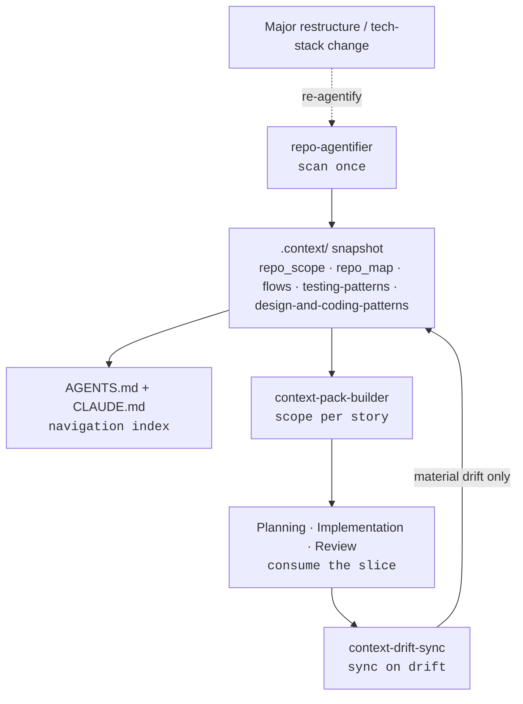

# Context Engineering

How ARCUS gives agents durable, token-efficient knowledge of your repository — built **once**, scoped **per story**, and synced **on drift**.

---

## The Problem

A coding agent that re-reads your whole repository on every task is slow, expensive, and inconsistent.
It burns tokens rediscovering the same structure, draws different conclusions each run, and still
misses the conventions your team takes for granted. ARCUS solves this with **context engineering**: a
small set of durable, evidence-grounded artifacts that capture how the repository is built, run,
tested, and structured — written once and reused by every stage of the pipeline.

The guiding principle is **scan once, scope per story, sync on drift**:

- **Scan once** — `repo-agentifier` builds the shared snapshot a single time per repository.
- **Scope per story** — each story pulls only the slice of the snapshot it needs into a context pack.
- **Sync on drift** — after a change merges, only the artifacts the diff *materially* changed are
  surgically updated — never a full rescan.

## The Five `.context/` Artifacts

`repo-agentifier` produces a token-efficient snapshot under `.context/`:

| Artifact | Captures | Maintained by |
|----------|----------|---------------|
| `repo_scope.md` | Business scope: purpose, core responsibilities, boundaries, tech-stack signals | Re-agentify / drift sync |
| `repo_map.md` | Technical map: directory layout, entry surfaces, key modules, config hotspots | Re-agentify / drift sync |
| `flows/*.md` | Discovered business flows — entry points, core path, data touchpoints, integrations | Re-agentify / drift sync |
| `testing-patterns.md` | Test layers, frameworks, conventions, and execution commands | Re-agentify / drift sync |
| `design-and-coding-patterns.md` | Design patterns in use, layering/structure, naming/idioms, error-handling conventions, and a curated **Avoid** list | Re-agentify / **drift sync only** (static by design) |

Each artifact carries a `context-meta` header (`verification-commit`, `generated-at`, `confidence`) so
the system knows exactly which commit it was last verified against.

::: tip design-and-coding-patterns is static by design
Unlike the other artifacts, `design-and-coding-patterns.md` is **not** refreshed on routine diffs. It
records the repository's *settled* conventions, so [Context Sync](/concepts/pipeline) updates it **only**
when a genuinely new, team-level pattern/convention/idiom is adopted (recurring in ≥3 places) or an
existing one is superseded. Its **Avoid** section holds prescriptive anti-pattern rules — not an
inventory of offending files.
:::

## The Role of `AGENTS.md` and `CLAUDE.md`

The `.context/` artifacts are the source of truth; two root files make them discoverable:

- **`AGENTS.md`** — an agent-facing **navigation index** generated from `.context/`. It points agents
  at the right artifact for the task at hand (tech stack, directory layout, testing conventions,
  design & coding patterns, business flows) so they load only what they need.
- **`CLAUDE.md`** — a one-line `@AGENTS.md` import so Claude Code inlines the index at session start.

## Lifecycle

## Re-agentify vs. Trust-Sync

There are two ways the snapshot stays current; choosing the right one matters:

- **Trust-sync (default).** After each approved change, `context-drift-sync` assesses the branch diff
  and surgically updates only the artifacts it *materially* changed — facts-only, diff-driven, no full
  rescan. This is the normal, per-story maintenance path and keeps token cost low.
- **Re-agentify (rare).** Re-run `repo-agentifier` from scratch only after a **major restructure** or
  **tech-stack change**, when incremental drift sync would be chasing too many moving parts. This
  rebuilds the entire snapshot and regenerates `AGENTS.md`.

Prefer trust-sync for everyday work; reach for re-agentify only when the repository's shape has
fundamentally shifted.

## Next Steps

- See the [ARCUS Pipeline](/concepts/pipeline) for where Context Sync sits in the stage map.
- See the [Introduction](/guide/introduction) for how `repo-agentifier` first builds the snapshot.
