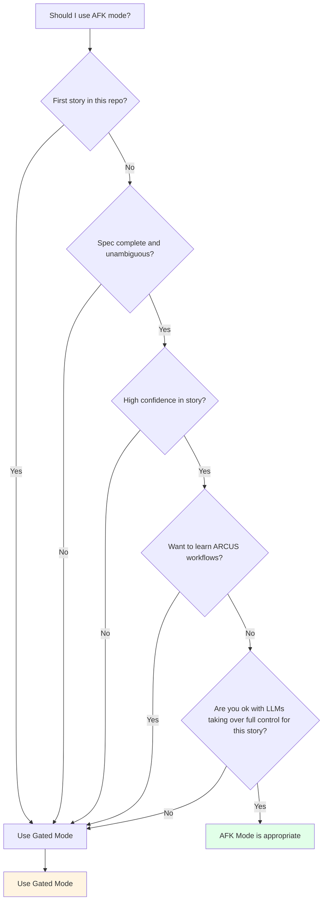

# Gated vs AFK Mode

Choosing between Gated and AFK modes

---

## Side-by-Side Comparison

| Aspect | Gated Mode (Default) | AFK Mode (Autonomous) |
|--------|---------------------|----------------------|
| **Control** | Pauses at each handoff gate | Runs all 6 stages back-to-back |
| **User Role** | Review artifacts, say "yes" to proceed | Hands-off until PR ready |
| **Best For** | Novel domains, high-risk changes, learning | Familiar codebases, simple features |
| **Intervention Points** | 4 handoff gates (GATE A-D) | Milestone-only output |
| **Session Resumability** | Yes, can pause and resume across days | Resume-capable via checkpoint; intended to run uninterrupted |
| **Spec Finalization** | Interactive dialogue (asks questions one-by-one) | One-shot auto-resolution |
| **Output Verbosity** | Full progress updates at each gate | Compact, final artifacts only |
| **When to Use** | Default for safety and learning | When you're confident in the spec |
| **Typical Duration** | 30-90 min active time (spread over hours/days) | 30-90 min uninterrupted |
| **Mistakes Caught** | Early (at each gate before proceeding) | Late (after full implementation) |
| **Context Switching** | Friendly (pause anytime, resume later) | Hostile (must complete in one session) |

---

## Decision Guide

### Should you use AFK mode?

Follow this decision tree:



**When in doubt:** Use **Gated Mode** (default, safe)

---

## When to Choose Gated Mode

**First time using ARCUS in this repository**  
You need to see how ARCUS interprets your patterns

**Story has ambiguities or missing details**  
Gated mode asks clarifying questions interactively

**Unfamiliar domain or complex requirements**  
Review each stage to catch misunderstandings early

**Want to review each stage's output before proceeding**  
See assumptions, test plan, and implementation incrementally

**Need to pause and resume across multiple sessions**  
Real work isn't always uninterrupted - gated mode respects that

**Learning how ARCUS works**  
See the workflow stage-by-stage to understand the process

**High-risk changes (security, performance, critical paths)**  
Extra review gates prevent costly mistakes

**Working with a new team or codebase**  
Verify ARCUS follows your conventions

---

## When to Choose AFK Mode

**High-confidence, well-defined story**  
No ambiguities, clear acceptance criteria, obvious approach

**Familiar codebase and domain**  
ARCUS knows your patterns, you trust its decisions

**Simple feature or bug fix**  
Straightforward changes with low risk

**Trust ARCUS to handle ambiguities automatically**  
Spec finalizer's one-shot mode makes good default choices

**Experienced ARCUS user**  
You know what to expect and trust the outputs

**Tight deadline, need speed**  
AFK mode is faster (no handoff pauses)

---

## How to Trigger Each Mode

### Gated Mode (Default)

Just use the standard command:

```
implement story.md
build story.md
forge story.md
```

No flags needed - gated is the default.

**What happens:**
- ARCUS runs Stage 0 (Init)
- Flows directly into Stage 1 (no Stage 0 handoff gate)
- First explicit handoff is **GATE A** after Brainstorm
- You say: `yes` or `no`

### AFK Mode (Opt-In)

Add `--afk` flag or use AFK-specific triggers:

```
run afk on story.md
implement story.md --afk
build story.md --afk
```

**What happens:**
- ARCUS runs all 6 stages back-to-back
- No pauses (all gates auto-confirm)
- Milestone output only (less verbose)
- Returns when PR is ready

---

## Example Scenarios

### Scenario 1: First Story in New Repo

**Situation:** You just agentified a new codebase, writing your first story

**Recommendation:** **Gated Mode**

**Why:**
- ARCUS needs to learn your patterns
- You need to verify it understood your conventions
- Review assumptions and blueprint before code is written
- Catch misalignments early

**Command:**
```
implement story.md
```

---

### Scenario 2: 10th Story, Simple Bug Fix

**Situation:** Fixing a typo in validation message, well-understood change

**Recommendation:** **AFK Mode** (if time permits)

**Why:**
- You know exactly what needs to change
- Story is crystal clear ("Change error message from X to Y")
- Low risk, familiar code area
- ARCUS has proven pattern recognition in this repo

**Command:**
```
run afk on bug-fix-story.md
```

**Fallback:** Use gated if you might be interrupted

---

### Scenario 3: Complex Feature, Unclear Requirements

**Situation:** Adding new authentication flow, some details TBD

**Recommendation:** **Gated Mode**

**Why:**
- Ambiguities need resolution (interactive dialogue helps)
- Review assumptions before implementation starts
- Verify test coverage before code is written
- High-risk area (authentication)

**Command:**
```
implement auth-feature-story.md
```

---

### Scenario 4: Well-Defined Feature, Tight Deadline

**Situation:** Clear spec, familiar domain, need it done today

**Recommendation:** **AFK Mode** if story quality is high, else **Gated**

**Why:**
- Speed matters (AFK saves 10-15 min on handoffs)
- BUT: Only if spec is genuinely unambiguous
- Bad spec + AFK = wasted time fixing wrong implementation

**Decision point:** Review your story:
- Clear acceptance criteria? → AFK candidate
- Any "TBD" or vague language? → Gated (dialogue will save time)

**Command if clear:**
```
run afk on feature-story.md
```

---

## Switching Modes Mid-Pipeline

**Can I switch from gated to AFK mid-pipeline?**  
No, mode is set at pipeline start and persists through all stages.

**Can I switch from AFK to gated?**  
No, AFK runs to completion without pauses.

**Workaround:** Pause at next gate (gated only), restart with different mode if needed.

---

## Common Mistakes

### Using AFK for First Story
**Problem:** ARCUS hasn't learned your patterns yet  
**Result:** May miss conventions, generate non-idiomatic code  
**Fix:** Use gated mode for first 2-3 stories, then switch to AFK

### Using Gated When Unavailable
**Problem:** Start gated mode, then get interrupted and don't return for days  
**Result:** Context is stale, hard to remember where you were  
**Fix:** Use AFK if you can't commit to reviewing gates promptly, or use `where am I?` to resume

### Using AFK with Vague Story
**Problem:** Spec has ambiguities, AFK auto-resolves incorrectly  
**Result:** Implementation doesn't match intent, requires rework  
**Fix:** Use gated dialogue to clarify ambiguities first

### Expecting AFK to Pause
**Problem:** Start AFK mode, realize you need to intervene  
**Result:** Can't pause (no gates), have to let it complete or abort  
**Fix:** Only use AFK when you're truly hands-off

---

## Mode Selection Checklist

Before running `implement story.md`, ask yourself:

**Gated Mode if ANY of these are true:**
- First 1-3 stories in this repo
- Story has any ambiguities or unknowns
- I want to review each stage before proceeding
- I might need to pause and resume later
- I'm learning ARCUS or exploring workflows
- High-risk change (security, performance, core logic)

**AFK Mode if ALL of these are true:**
- Story is 100% clear and unambiguous
- I trust ARCUS patterns in this repo (not first story)
- I can dedicate 30-90 min uninterrupted
- I don't need to review intermediate artifacts
- Low-to-medium risk change
- I've used ARCUS successfully here before

**When in doubt:** Use **Gated Mode** (default, safe)
