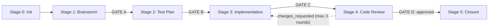

# The ARCUS Pipeline

Understanding ARCUS's 6-stage SDLC workflow

---

## The Pipeline at a Glance

ARCUS transforms a written user story into a reviewed, test-backed pull request through six sequential stages:

1. **Stage 0: Init** - Branch & Workspace
2. **Stage 1: Brainstorm** - Resolve Ambiguities & Finalize Plan (GATE A)
3. **Stage 2: Test Plan** - Design Test Matrix (GATE B)
4. **Stage 3: Implementation** - Implement & Verify (GATE C)
5. **Stage 4: Code Review** - Holistic Quality Check (GATE D)
6. **Stage 5: Closure** - Create Pull Request

Stages produce specific artifacts, and the pipeline pauses at handoff gates between stages (in gated mode). Stage 0 flows directly into Stage 1 without a handoff gate. The Code Review stage (Stage 4) can loop back to Implementation up to 3 times if changes are requested.

## What The Gates Mean

Gates are explicit pause points where you review outputs before the pipeline moves to the next stage.

| Gate | Between Stages | Meaning |
|------|----------------|---------|
| Gate A | Brainstorm -> Test Plan | Assumptions and planning artifacts are ready for test design. |
| Gate B | Test Plan -> Implementation | Test strategy is approved; implementation can begin. |
| Gate C | Implementation -> Code Review | Code and tests are complete; ready for holistic review. |
| Gate D | Code Review -> Closure (or loopback) | Review decision point: approve for PR, or send fixes back to Implementation. |

In gated mode, ARCUS pauses at each gate and waits for your confirmation. In AFK mode, gates are auto-confirmed.

---

## Stage Breakdown

### Stage 0: Init

<table class="pipeline-stage-table">
  <tr>
    <th colspan="3">Purpose: Set up workspace and prepare for development</th>
  </tr>
  <tr>
    <th><strong>What happens</strong></th>
    <th><strong>Skills involved</strong></th>
    <th><strong>Artifacts created</strong></th>
  </tr>
  <tr>
    <td>
      <ul>
        <li>Creates feature branch: <code>arcus/[STORY-ID]</code></li>
        <li>Scaffolds <code>.arcus/specs/[STORY-ID]/</code> directory</li>
        <li>Copies story file to workspace</li>
        <li>Initializes <code>session-checkpoint.json</code> (pipeline state tracker)</li>
      </ul>
    </td>
    <td>
      <ul>
        <li><code>arcus-controller</code> (deterministic Stage 0 via helper scripts)</li>
      </ul>
    </td>
    <td>
      <ul>
        <li><code>.arcus/specs/[STORY-ID]/story.md</code> (copy of original)</li>
        <li><code>.arcus/session-checkpoint.json</code> (state tracking)</li>
        <li>Git branch <code>arcus/[STORY-ID]</code></li>
      </ul>
    </td>
  </tr>
  <tr>
    <td colspan="3"><strong>Handoff:</strong> No handoff gate. Stage 0 flows directly into Stage 1.</td>
  </tr>
</table>

**What to check:**
- Branch created successfully
- Story copied correctly to workspace
- Ready to proceed

---

### Stage 1: Brainstorm

<table class="pipeline-stage-table">
  <tr>
    <th colspan="3">Purpose: Resolve ambiguities and document technical decisions</th>
  </tr>
  <tr>
    <th><strong>What happens</strong></th>
    <th><strong>Skills involved</strong></th>
    <th><strong>Artifacts created</strong></th>
  </tr>
  <tr>
    <td>
      <ul>
        <li>Analyzes story for completeness</li>
        <li>Identifies ambiguous requirements</li>
        <li><strong>Gated mode:</strong> Asks clarifying questions one-by-one (dialogue)</li>
        <li><strong>AFK mode:</strong> Auto-resolves ambiguities (one-shot)</li>
        <li>Documents assumptions and constraints</li>
        <li>Optionally builds story-specific context pack</li>
        <li>Creates implementation plan (<code>blueprint.md</code>) before implementation begins</li>
      </ul>
    </td>
    <td>
      <ul>
        <li><code>spec-finalizer</code> (dialogue mode or one-shot)</li>
        <li><code>context-pack-builder</code> (optional, for story-specific context)</li>
        <li><code>implementation-planner</code> (creates <code>blueprint.md</code>)</li>
      </ul>
    </td>
    <td>
      <ul>
        <li><code>assumptions.md</code> - Technical decisions, constraints, error handling</li>
        <li><code>clarifications.md</code> - User answers (gated mode only)</li>
        <li><code>context-pack.md</code> - Story-specific context (optional)</li>
        <li><code>blueprint.md</code> - Implementation plan with atomic tasks</li>
      </ul>
    </td>
  </tr>
  <tr>
    <td colspan="3"><strong>Handoff Gate A:</strong> "Assumptions and implementation plan documented, ready for test planning?"</td>
  </tr>
</table>

**What to check:**
- Assumptions align with your intent
- No missing technical constraints
- Error handling approach makes sense
- Architecture decisions are correct

**Tip:** This is your chance to course-correct before implementation. Review assumptions carefully.

---

### Stage 2: Test Plan

<table class="pipeline-stage-table">
  <tr>
    <th colspan="3">Purpose: Design comprehensive test matrix before writing code</th>
  </tr>
  <tr>
    <th><strong>What happens</strong></th>
    <th><strong>Skills involved</strong></th>
    <th><strong>Artifacts created</strong></th>
  </tr>
  <tr>
    <td>
      <ul>
        <li>Reviews blueprint and assumptions</li>
        <li>Designs test cases across three categories:
          <ul>
            <li><strong>Functional:</strong> Happy path verification</li>
            <li><strong>Edge Case:</strong> Boundary conditions, null handling</li>
            <li><strong>Error Handling:</strong> Validation failures, exception paths</li>
          </ul>
        </li>
        <li>Maps each test to blueprint task IDs</li>
        <li>Follows patterns from <code>.context/testing-patterns.md</code></li>
      </ul>
    </td>
    <td>
      <ul>
        <li><code>test-spec-compiler</code></li>
      </ul>
    </td>
    <td>
      <ul>
        <li><code>test-plan.md</code> - Test matrix with functional/edge/error categories</li>
      </ul>
    </td>
  </tr>
  <tr>
    <td colspan="3"><strong>Handoff Gate B:</strong> "Test plan complete, ready to implement?"</td>
  </tr>
</table>

**What to check:**
- Test coverage feels comprehensive
- Edge cases captured
- Error scenarios realistic
- Test structure follows repo patterns

**Tip:** Add missing test cases to `test-plan.md` before proceeding. This is TDD in action.

---

### Stage 3: Implementation

<table class="pipeline-stage-table">
  <tr>
    <th colspan="3">Purpose: Implement the story with continuous verification</th>
  </tr>
  <tr>
    <th><strong>What happens</strong></th>
    <th><strong>Skills involved</strong></th>
    <th><strong>Artifacts created</strong></th>
  </tr>
  <tr>
    <td>
      <ul>
        <li>Dispatches each task to isolated subagent</li>
        <li>Each task includes:
          <ul>
            <li>Implementation</li>
            <li>Test writing (following test-plan.md)</li>
            <li>Per-task compliance review</li>
            <li>Per-task quality review</li>
          </ul>
        </li>
        <li>Commits code incrementally (one commit per task)</li>
        <li>Runs tests after each task</li>
      </ul>
    </td>
    <td>
      <ul>
        <li><code>subagent-task-dispatcher</code> (orchestrates task execution)</li>
        <li><code>spec-compliance-reviewer</code> (per-task mode)</li>
        <li><code>code-quality-reviewer</code> (per-task mode)</li>
      </ul>
    </td>
    <td>
      <ul>
        <li>Code changes (committed to branch)</li>
        <li>Tests (committed alongside code)</li>
      </ul>
    </td>
  </tr>
  <tr>
    <td colspan="3"><strong>Handoff Gate C:</strong> "All tasks complete, tests passing, ready for holistic review?"</td>
  </tr>
</table>

**What to check:**
- All tests pass locally
- Implementation feels complete
- No obvious gaps or missing features
- Commits are clean and atomic

**Tip:** You can edit `blueprint.md` at Gate A or Gate B before implementation begins.

---

### Stage 4: Code Review

<table class="pipeline-stage-table">
  <tr>
    <th colspan="3">Purpose: Holistic quality check across all changes</th>
  </tr>
  <tr>
    <th><strong>What happens</strong></th>
    <th><strong>Skills involved</strong></th>
    <th><strong>Artifacts created</strong></th>
  </tr>
  <tr>
    <td>
      <ul>
        <li>Reviews <strong>full branch diff</strong> (not individual tasks)</li>
        <li>Runs multiple review perspectives:
          <ul>
            <li><strong>Spec compliance</strong> (holistic): Does it meet all requirements?</li>
            <li><strong>Code quality</strong> (holistic): Clean structure, maintainability?</li>
            <li><strong>Security</strong>: Any exploitable vulnerabilities?</li>
            <li><strong>Performance</strong>: Any concrete regressions?</li>
          </ul>
        </li>
        <li>Consolidates findings</li>
        <li>Deduplicates and filters noise</li>
        <li>Assigns severity levels:
          <ul>
            <li><strong>critical</strong> - Blocks merge (outage, data loss, security breach)</li>
            <li><strong>warning</strong> - Concrete issue (performance hit, maintainability concern)</li>
            <li><strong>suggestion</strong> - Minor nit (non-blocking)</li>
          </ul>
        </li>
        <li>Returns verdict: <code>approved</code> or <code>changes_requested</code></li>
      </ul>
    </td>
    <td>
      <ul>
        <li><code>code-reviewer</code> (coordinator)</li>
        <li><code>spec-compliance-reviewer</code> (holistic mode)</li>
        <li><code>code-quality-reviewer</code> (holistic mode)</li>
        <li><code>security-reviewer</code></li>
        <li><code>performance-reviewer</code></li>
      </ul>
    </td>
    <td>
      <ul>
        <li><code>review.md</code> - Consolidated findings with verdict</li>
      </ul>
    </td>
  </tr>
  <tr>
    <td colspan="3"><strong>Handoff Gate D:</strong> If approved: "Review passed, ready to create PR?" | If changes_requested: "Issues found, fix and re-review? (Auto-loops up to 3 rounds)"</td>
  </tr>
</table>

**What to check:**
- Review findings are accurate
- Severity levels appropriate
- No false positives
- Critical issues are genuine blockers

**Tip:** If you disagree with findings, you can proceed anyway (override verdict).

---

### Stage 5: Closure

<table class="pipeline-stage-table">
  <tr>
    <th colspan="3">Purpose: Create pull request with evidence and context</th>
  </tr>
  <tr>
    <th><strong>What happens</strong></th>
    <th><strong>Skills involved</strong></th>
    <th><strong>Artifacts created</strong></th>
  </tr>
  <tr>
    <td>
      <ul>
        <li>Runs final test suite</li>
        <li>Gathers evidence of completion</li>
        <li>Synthesizes PR description from:
          <ul>
            <li>Original story</li>
            <li>Assumptions</li>
            <li>Blueprint</li>
            <li>Test results</li>
            <li>Review findings</li>
          </ul>
        </li>
        <li>Creates pull request (if <code>gh</code> CLI configured)</li>
      </ul>
    </td>
    <td>
      <ul>
        <li><code>pull-request-builder</code></li>
      </ul>
    </td>
    <td>
      <ul>
        <li><code>PR_DESCRIPTION.md</code> - Final PR body</li>
      </ul>
    </td>
  </tr>
  <tr>
    <td colspan="3"><strong>Handoff Gate:</strong> Terminal stage - PR created or ready for manual creation</td>
  </tr>
</table>

**What to check:**
- PR description is accurate and complete
- All tests pass
- Branch is up to date with base

---

## Review Loopback Mechanism

If Stage 4 returns `changes_requested`:

1. **Fix-tasks generated** from review findings
2. **Loop back to Stage 3** (Implementation)
3. **Subagents address issues** following fix-tasks
4. **Return to Stage 4** for re-review
5. **Bounded to 3 rounds maximum** to prevent infinite loops
6. **Manual intervention** required if 3rd round still fails

**Why bounded?** Prevents loops on subjective or unclear issues. After 3 rounds, human judgment needed.

---

## Quick Stage Reference

| Stage | Entry Command | Exit Condition |
|-------|---------------|----------------|
| 0: Init | `implement story.md` | Workspace ready |
| 1: Brainstorm | Auto or `brainstorm story` | `assumptions.md` and `blueprint.md` complete |
| 2: Test Plan | Auto or `generate tests story` | `test-plan.md` complete |
| 3: Implementation | Auto or `code story` | All tasks done, tests pass |
| 4: Code Review | Auto or `review story` | Verdict: approved/changes |
| 5: Closure | Auto or `close story` | PR created |

---

## Artifacts

Each story produces a working area under `.arcus/specs/[STORY-ID]/` with the following artifacts:

| Artifact | Purpose |
|----------|---------|
| `session-checkpoint.json` | Resumable per-stage execution state (status enum) |
| `story.md` | Canonical copy of the input story |
| `context-pack.md` | Compact, token-efficient context bundle |
| `clarifications.md` | Answers captured during the Brainstorm dialogue |
| `assumptions.md` | Explicit assumptions used to resolve ambiguity |
| `blueprint.md` | Implementation plan and task list |
| `test-plan.md` | Generated verification matrix and test cases |
| `review.md` | Holistic code-review report + verdict |
| `PR_DESCRIPTION.md` | Final PR body |

Treat `.arcus/` as ephemeral working data - safe to inspect, commit, or discard.
