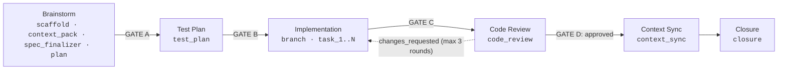

# The ARCUS Pipeline

Understanding ARCUS's full Spec → Code → Pull Request stage map

<style>
.pipeline-stage-table th,
.pipeline-stage-table td {
  vertical-align: top;
}
</style>

---

::: tip Where the canonical list lives
This page is the **single human-readable enumeration** of the ARCUS pipeline. The stateful
`arcus-controller` orchestrator owns the session checkpoint and stage gates, driving the 6 phases by
handing each capability its explicit inputs (see [Modes](/concepts/modes)).
:::

::: info Built from reusable capabilities
Each stage below is built from the three-tier capability library — atomic capabilities, thin
coordinators, and the stateful orchestrator. See [The Capability Library](/concepts/capability-library)
for how the pipeline's stages are assembled from reusable, plug-n-play building blocks.
:::

## The Pipeline at a Glance

ARCUS transforms a written user story into a reviewed, test-backed pull request through a sequence of
stages, tracked in the session checkpoint by these ordered **stage keys**:

```
scaffold → context_pack → spec_finalizer → plan → test_plan → branch → task_1..N → code_review → context_sync → closure
```

The ten stages group into **six human-facing phases**:

1. **Brainstorm** — Scaffold the workspace, build the context pack, finalize the spec, and produce
   the implementation plan (`scaffold`, `context_pack`, `spec_finalizer`, `plan`; GATE A)
2. **Test Plan** — Design the verification matrix (`test_plan`; GATE B)
3. **Implementation** — Create the branch, then implement & verify each task (`branch`, `task_1..N`; GATE C)
4. **Code Review** — Two-tier holistic gate over the whole branch diff (`code_review`; GATE D)
5. **Context Sync** — Reconcile the shared `.context/` artifacts that the approved diff materially drifted (`context_sync`; automatic continuation)
6. **Closure** — Create the pull request (`closure`)



Stages produce specific artifacts. In the **gated** experience the pipeline pauses at each handoff
gate, where the orchestrator presents the just-finished stage's output; you reply "yes" (same
session) or use the stage's explicit resume phrase (cold resume). Within Brainstorm the
`scaffold`, `context_pack`, `spec_finalizer`, and `plan` stages run back-to-back — the
`kick-off` coordinator runs context-pack-builder → spec-finalizer — before the first gate (GATE A).
The Code Review stage can loop back to Implementation up to 3 times if changes are requested.

## What The Gates Mean

Gates are explicit pause points where you review outputs before the pipeline moves to the next stage
(gated experience only).

| Gate | Between Stages | Meaning |
|------|----------------|---------|
| Gate A | Brainstorm → Test Plan | Grounded spec and plan are ready for test design. |
| Gate B | Test Plan → Implementation | Test strategy is approved; the branch can be created and implementation can begin. |
| Gate C | Implementation → Code Review | Code and tests are complete; ready for holistic review. |
| Gate D | Code Review → Context Sync (or loopback) | Review decision point: approve (advances to Context Sync, which then auto-continues to Closure), or send fixes back to Implementation. |

Context Sync → Closure is an **automatic continuation** (no user decision gate — like Test Plan auto-running): once the `.context/` reconciliation is decided, the pipeline proceeds straight to Closure.

In **interactive** mode (the gated default), ARCUS pauses at each gate and waits for your
confirmation. In **autonomous** (AFK) mode, the `arcus-controller` auto-confirms every gate and runs
end-to-end.

---

## Stage Breakdown

### Scaffold

<table class="pipeline-stage-table">
  <tbody>
  <tr>
    <th colspan="3">Purpose: Set up the workspace and record the planned branch — without creating actual git branch</th>
  </tr>
  <tr>
    <th><strong>What happens</strong></th>
    <th><strong>Skills / scripts involved</strong></th>
    <th><strong>Artifacts created</strong></th>
  </tr>
  <tr>
    <td>
      <ul>
        <li>Scaffolds <code>.arcus/specs/[STORY-ID]/</code> directory</li>
        <li>Copies story file to the workspace</li>
        <li>Initializes <code>session-checkpoint.json</code> recording the <strong>planned</strong> <code>branch_name</code> / <code>base_branch</code></li>
        <li><strong>No git branch is created</strong> — branch creation is deferred to the <code>branch</code> stage at the start of Implementation. See [Deferred Branch Creation](#deferred-branch-creation)</li>
      </ul>
    </td>
    <td>
      <ul>
        <li><code>scaffold.sh</code> (deterministic script)</li>
        <li>Branch naming via <code>scripts/lib/branch_name.sh</code></li>
        <li>Driven by <code>arcus-controller</code> (orchestrator; interactive or autonomous)</li>
      </ul>
    </td>
    <td>
      <ul>
        <li><code>.arcus/specs/[STORY-ID]/story.md</code> (copy of original)</li>
        <li><code>.arcus/session-checkpoint.json</code> (planned branch fields, no branch)</li>
      </ul>
    </td>
  </tr>
  <tr>
    <td colspan="3"><strong>Handoff:</strong> No handoff gate. Scaffold flows directly into Brainstorm.</td>
  </tr>
  </tbody>
</table>

**What to check:**
- Story copied correctly to workspace
- Planned branch name looks right (`arcus/[STORY-ID]-N`)

---

### Brainstorm

<table class="pipeline-stage-table">
  <tbody>
  <tr>
    <th colspan="3">Purpose: Build context, resolve ambiguities, capture design decisions and produce a task-level plan</th>
  </tr>
  <tr>
    <th><strong>What happens</strong></th>
    <th><strong>Skills involved</strong></th>
    <th><strong>Artifacts created</strong></th>
  </tr>
  <tr>
    <td>
      <ul>
        <li>Builds a story-specific context pack (stage key <code>context_pack</code>)</li>
        <li>Analyzes the story for completeness and resolves ambiguity (stage key <code>spec_finalizer</code>)</li>
        <li><strong>Gated:</strong> spec-finalizer and implementation-planner run as <strong>dialogues in the main thread</strong>; every interview question presents exactly one <strong>Recommended</strong> option + one-line rationale + a custom-answer option</li>
        <li><strong>AFK:</strong> both run one-shot inside subagents, auto-resolving every ambiguity / auto-selecting the highest-scoring approach</li>
        <li>Produces the implementation plan and task list (stage key <code>plan</code>)</li>
      </ul>
    </td>
    <td>
      <ul>
        <li><code>kick-off</code> coordinator (sequences context-pack-builder → spec-finalizer)</li>
        <li><code>context-pack-builder</code></li>
        <li><code>spec-finalizer</code> (dialogue in interactive, one-shot in autonomous)</li>
        <li><code>implementation-planner</code> (dialogue in interactive, one-shot in autonomous)</li>
        <li>Driven by <code>arcus-controller</code> (orchestrator; interactive or autonomous)</li>
      </ul>
    </td>
    <td>
      <ul>
        <li><code>context-pack.md</code> — Story-specific context bundle</li>
        <li><code>grounded-spec.md</code> — Grounded story decisions (context grounding, resolved ambiguities, dialogue answers, implementation boundary) — written by spec-finalizer</li>
        <li><code>plan.md</code> — Design deliberation (approach evaluation, chosen approach, impacted files) plus the atomic <code>### Task N:</code> task list — written by implementation-planner</li>
      </ul>
    </td>
  </tr>
  <tr>
    <td colspan="3"><strong>Handoff Gate A:</strong> "Planning complete → next: Test Plan." Resume phrase: <code>generate test plan for &lt;STORY-ID&gt;</code>.</td>
  </tr>
  </tbody>
</table>

**What to check:**
- Grounded decisions in `grounded-spec.md` align with your intent
- No missing technical constraints; error handling makes sense
- Tasks in `plan.md` are atomic and correctly ordered

**Tip:** This is the place where "make-or-break" decisions are taken before implementation. Review `grounded-spec.md` and
`plan.md` carefully.

---

### Test Plan

<table class="pipeline-stage-table">
  <tbody>
  <tr>
    <th colspan="3">Purpose: Design comprehensive test matrix before writing code</th>
  </tr>
  <tr>
    <th><strong>What happens</strong></th>
    <th><strong>Skills involved</strong></th>
    <th><strong>Artifacts created</strong></th>
  </tr>
  <tr>
    <td>
      <ul>
        <li>Reviews the task list in <code>plan.md</code> and the grounded decisions in <code>grounded-spec.md</code></li>
        <li>Designs test cases across three categories:
          <ul>
            <li><strong>Functional:</strong> Happy path verification</li>
            <li><strong>Edge Case:</strong> Boundary conditions, null handling</li>
            <li><strong>Error Handling:</strong> Validation failures, exception paths</li>
          </ul>
        </li>
        <li>Maps each test to <code>plan.md</code> task IDs</li>
        <li>Follows patterns from <code>.context/testing-patterns.md</code></li>
      </ul>
    </td>
    <td>
      <ul>
        <li><code>test-spec-compiler</code> (stage key <code>test_plan</code>)</li>
      </ul>
    </td>
    <td>
      <ul>
        <li><code>test-plan.md</code> — Test matrix with functional/edge/error categories</li>
      </ul>
    </td>
  </tr>
  <tr>
    <td colspan="3"><strong>Handoff Gate B:</strong> "Test plan complete → next: Implementation." Resume phrase: <code>implement &lt;STORY-ID&gt;</code>.</td>
  </tr>
  </tbody>
</table>

**What to check:**
- Test coverage feels comprehensive
- Edge cases captured; error scenarios realistic
- Test structure follows repo patterns

**Tip:** Add missing test cases to `test-plan.md` before proceeding. This is TDD in action.

---

### Implementation

<table class="pipeline-stage-table">
  <tbody>
  <tr>
    <th colspan="3">Purpose: Create the branch, then implement the story with continuous verification</th>
  </tr>
  <tr>
    <th><strong>What happens</strong></th>
    <th><strong>Skills involved</strong></th>
    <th><strong>Artifacts created</strong></th>
  </tr>
  <tr>
    <td>
      <ul>
        <li><strong>Branch stage (<code>branch</code>):</strong> realizes the git branch that was only <em>planned</em> at scaffold — <code>branch.sh</code> creates <code>arcus/[STORY-ID]-N</code> from the base, bumps the index on collision, and calls <code>checkpoint.sh set-branch</code> if the realized name differs from the plan</li>
        <li>Parses <code>### Task N:</code> headings from <code>plan.md</code> (stage keys <code>task_1</code>..<code>task_N</code>)</li>
        <li>Dispatches each task to an isolated subagent. Each task includes:
          <ul>
            <li>Implementation</li>
            <li>Test writing (following <code>test-plan.md</code>)</li>
            <li>Refactor gate (<code>code-simplifier</code>): mutate toward simplicity, re-run suite — skipped on <code>light</code> tasks</li>
            <li>One lightweight, <strong>advisory</strong> per-task spec-compliance check (does not hard-block; unresolved issues carry forward to Code Review)</li>
          </ul>
        </li>
        <li>Commits code incrementally (one commit per task via <code>commit.sh</code>)</li>
      </ul>
      <p><em>Quality is not reviewed per-task — it is owned holistically by Code Review over the whole branch diff, since isolated subagents never see prior tasks' code.</em></p>
    </td>
    <td>
      <ul>
        <li><code>implementation-runner</code> (the single canonical loop driver — owns the branch step + task loop; reused by gated and afk)</li>
        <li><code>branch.sh</code> (deferred branch realization)</li>
        <li><code>subagent-task-dispatcher</code> (per-task execution)</li>
        <li><code>code-simplifier</code> (per-task refactor gate, skipped on <code>light</code>)</li>
        <li><code>spec-compliance-reviewer</code> (per-task mode, advisory)</li>
      </ul>
    </td>
    <td>
      <ul>
        <li>Git branch <code>arcus/[STORY-ID]-N</code> (created here, not at scaffold)</li>
        <li>Code changes (committed to branch)</li>
        <li>Tests (committed alongside code)</li>
      </ul>
    </td>
  </tr>
  <tr>
    <td colspan="3"><strong>Handoff Gate C:</strong> "Implementation complete → next: Code Review." Resume phrase: <code>review &lt;STORY-ID&gt;</code>.</td>
  </tr>
  </tbody>
</table>

**What to check:**
- All tests pass locally
- Implementation feels complete; no obvious gaps
- Commits are clean and atomic

**Tip:** You can edit the task list in `plan.md` at Gate A or Gate B before implementation begins.

---

### Code Review

<table class="pipeline-stage-table">
  <tbody>
  <tr>
    <th colspan="3">Purpose: The real last gate before a PR — a two-tier review over all changes, with a zero-trust persona (brutal in the hunt, fair in the verdict)</th>
  </tr>
  <tr>
    <th><strong>What happens</strong></th>
    <th><strong>Skills involved</strong></th>
    <th><strong>Artifacts created</strong></th>
  </tr>
  <tr>
    <td>
      <ul>
        <li>Reviews the <strong>full branch diff</strong> (not individual tasks)</li>
        <li><strong>Tier 1 — Deterministic Gate (runs the repo's real tooling, fails fast):</strong> executes the actual commands CI would run over the integrated branch — never simulated by reading the diff. Resolved from CI workflows first, then <code>.context/</code> tables.
          <ul>
            <li>Typecheck / compile</li>
            <li>Full test suite (per-task green ≠ whole-branch green)</li>
            <li>Build + startup smoke</li>
            <li>Secret scan</li>
            <li>Lint &amp; format (auto-fixed and committed where a fix mode exists)</li>
            <li>Static analysis (feeds the semantic tier)</li>
          </ul>
          Any hard block (typecheck / tests / build / secret) skips the semantic fan-out and returns <code>changes_requested</code> immediately. Unresolvable commands are recorded as <code>skipped: not configured</code>.
        </li>
        <li><strong>Tier 2 — Semantic Review (only if the gate passes):</strong> fans out to specialists for judgment-grade concerns no tool can answer:
          <ul>
            <li><strong>Spec compliance</strong> (holistic): Does it meet all requirements?</li>
            <li><strong>Code quality</strong> (holistic): Clean structure, maintainability, cognitive complexity, test proportionality?</li>
            <li><strong>Security</strong>: Any exploitable vulnerabilities?</li>
            <li><strong>Performance</strong>: Any concrete regressions?</li>
            <li><strong>History/Context</strong>: Any load-bearing complexity removed, silently-reverted fixes, or re-added previously-reverted code? (skipped on docs-only diffs and shallow history)</li>
          </ul>
        </li>
        <li>Consolidates findings</li>
        <li>Deduplicates and filters noise</li>
        <li>Assigns severity levels:
          <ul>
            <li><strong>critical</strong> - Blocks merge (outage, data loss, security breach)</li>
            <li><strong>warning</strong> - Concrete issue (performance hit, maintainability concern)</li>
            <li><strong>suggestion</strong> - Minor nit (non-blocking)</li>
          </ul>
        </li>
        <li>Returns verdict: <code>approved</code> or <code>changes_requested</code></li>
      </ul>
    </td>
    <td>
      <ul>
        <li><code>code-reviewer</code> (coordinator + deterministic gate; stage key <code>code_review</code>)</li>
        <li><code>spec-compliance-reviewer</code> (holistic mode)</li>
        <li><code>code-quality-reviewer</code> (holistic mode)</li>
        <li><code>security-reviewer</code></li>
        <li><code>performance-reviewer</code></li>
        <li><code>history-context-reviewer</code></li>
      </ul>
    </td>
    <td>
      <ul>
        <li><code>review.md</code> - Deterministic gate results + consolidated semantic findings with verdict</li>
      </ul>
    </td>
  </tr>
  <tr>
    <td colspan="3"><strong>Handoff Gate D:</strong> If approved: "Review passed → next: Context Sync" (resume phrase <code>sync context for &lt;STORY-ID&gt;</code>) | If changes_requested: "Issues found, fix and re-review? (Auto-loops up to 3 rounds)"</td>
  </tr>
  </tbody>
</table>

**What to check:**
- Review findings are accurate; severity levels appropriate
- No false positives; critical issues are genuine blockers

**Tip:** If you disagree with findings, you can proceed anyway (override verdict).

---

### Context Sync

<table class="pipeline-stage-table">
  <tbody>
  <tr>
    <th colspan="3">Purpose: Reconcile the shared <code>.context/</code> artifacts that the approved branch diff materially drifted — facts-only, diff-driven, no full rescan</th>
  </tr>
  <tr>
    <th><strong>What happens</strong></th>
    <th><strong>Skills involved</strong></th>
    <th><strong>Artifacts created</strong></th>
  </tr>
  <tr>
    <td>
      <ul>
        <li>Strictly assesses whether the approved branch diff materially changed any <code>.context/</code> artifact (business flows, <code>repo_map.md</code>, <code>repo_scope.md</code>, <code>testing-patterns.md</code>, <code>design-and-coding-patterns.md</code>)</li>
        <li>Surgically syncs <strong>only the affected</strong> artifacts, refreshing their context-meta; updates <code>AGENTS.md</code> only when a flow file is added or removed</li>
        <li><strong>Facts-only and diff-driven</strong> — no full repository rescan</li>
        <li><strong>Gated:</strong> shows a drift assessment plus a single consolidated yes/no</li>
        <li><strong>AFK:</strong> auto-decides</li>
        <li>Also <strong>standalone-invocable</strong> via <code>sync context for &lt;STORY-ID&gt;</code> / <code>sync context</code></li>
        <li>Produces <strong>no new artifact</strong>; the rationale is persisted in the sync commit body</li>
      </ul>
    </td>
    <td>
      <ul>
        <li><code>context-drift-sync</code> (stage key <code>context_sync</code>)</li>
      </ul>
    </td>
    <td>
      <ul>
        <li>No new artifact — updates existing <code>.context/</code> files in place; rationale lives in the sync commit body</li>
      </ul>
    </td>
  </tr>
  <tr>
    <td colspan="3"><strong>Handoff:</strong> No user decision gate — Context Sync auto-continues to Closure once the reconciliation is decided.</td>
  </tr>
  </tbody>
</table>

**What to check:**
- The drift assessment correctly identifies which `.context/` artifacts the diff touched
- Only materially-affected artifacts were synced (no over-reach)

For the full picture of how the shared `.context/` artifacts are built, scoped, and kept current, see
[Context Engineering](/concepts/context-engineering).

---

### Closure

<table class="pipeline-stage-table">
  <tbody>
  <tr>
    <th colspan="3">Purpose: Create pull request with evidence and context</th>
  </tr>
  <tr>
    <th><strong>What happens</strong></th>
    <th><strong>Skills involved</strong></th>
    <th><strong>Artifacts created</strong></th>
  </tr>
  <tr>
    <td>
      <ul>
        <li>Runs final test suite</li>
        <li>Gathers evidence of completion</li>
        <li>Synthesizes PR description from:
          <ul>
            <li>Original story</li>
            <li>Grounded decisions in <code>grounded-spec.md</code></li>
            <li>Plan and task list (<code>plan.md</code>)</li>
            <li>Test results</li>
            <li>Review findings</li>
          </ul>
        </li>
        <li>Pushes the branch and creates the pull request via <code>pr.sh</code> (<code>gh pr create</code>); the <code>base_branch</code> read by <code>pr.sh</code> has been populated in the checkpoint since scaffold time</li>
      </ul>
    </td>
    <td>
      <ul>
        <li><code>pull-request-builder</code> (terminal stage; stage key <code>closure</code>)</li>
        <li><code>pr.sh</code></li>
      </ul>
    </td>
    <td>
      <ul>
        <li><code>PR_DESCRIPTION.md</code> - Final PR body</li>
      </ul>
    </td>
  </tr>
  <tr>
    <td colspan="3"><strong>Handoff Gate:</strong> Terminal stage — closes the gated chain. PR created or ready for manual creation.</td>
  </tr>
  </tbody>
</table>

**What to check:**
- PR description is accurate and complete
- All tests pass
- Branch is up to date with base

---

## Deferred Branch Creation

ARCUS creates the git branch **late** — at the start of Implementation, not during Scaffold:

1. **Scaffold** (`scaffold.sh`) creates the spec folder, copies `story.md`, and initializes the
   checkpoint recording the **planned** `branch_name` and `base_branch`. **No git branch exists yet.**
2. The branch naming convention `arcus/<STORY-ID>-N` is defined once in the shared
   `scripts/lib/branch_name.sh` library (sourced by both `scaffold.sh` and `branch.sh`).
3. **Implementation** begins with the `branch` stage: `branch.sh` (driven by the
   `implementation-runner` skill) reads the planned name, **re-checks for collisions** created since
   scaffold (bumping the index if needed), creates and checks out the branch, and calls
   `checkpoint.sh set-branch` if the realized name differs from the plan.

This keeps planning entirely on the base branch and only branches once there is actual code to commit.

---

## Review Loopback Mechanism

If Code Review returns `changes_requested`:

1. **Fix-tasks generated** from review findings (appended to `plan.md`)
2. **Loop back to Implementation** (re-enters `implementation-runner`)
3. **Subagents address issues** following the fix-tasks
4. **Return to Code Review** for re-review
5. **Bounded to 3 rounds maximum** to prevent infinite loops
6. **Manual intervention** required if the 3rd round still fails

**Why bounded?** Prevents loops on subjective or unclear issues. After 3 rounds, human judgment is needed.

---

## Quick Stage Reference

| Phase | Stage key(s) | Gated entry / resume phrase | Exit condition |
|-------|--------------|-----------------------------|----------------|
| Brainstorm | `scaffold`, `context_pack`, `spec_finalizer`, `plan` | `plan <STORY>` / `implement <STORY>` (interactive); `kick-off <STORY>` / `brainstorm <STORY>` (brainstorm-only) | Workspace + planned branch ready; `grounded-spec.md` and `plan.md` complete |
| Test Plan | `test_plan` | `generate test plan for <STORY>` | `test-plan.md` complete |
| Implementation | `branch`, `task_1..N` | `implement <STORY>` / `code <STORY>` | Branch created, all tasks done, tests pass |
| Code Review | `code_review` | `review <STORY>` | Verdict: approved / changes_requested |
| Context Sync | `context_sync` | `sync context for <STORY>` | Affected `.context/` artifacts reconciled (auto-continues to Closure) |
| Closure | `closure` | `close <STORY>` | PR created |

---

## Artifacts

Each story produces a working area under `.arcus/specs/[STORY-ID]/` with the following artifacts:

| Artifact | Purpose |
|----------|---------|
| `session-checkpoint.json` | Resumable per-stage execution state (ordered stage keys + status enum), including the planned/realized `branch_name` and `base_branch` |
| `story.md` | Canonical copy of the input story |
| `context-pack.md` | Compact, token-efficient context bundle |
| `grounded-spec.md` | Grounded story decisions: context grounding, resolved ambiguities, dialogue answers, implementation boundary (written by spec-finalizer) |
| `plan.md` | Design deliberation plus the atomic task list (written by implementation-planner) |
| `test-plan.md` | Generated verification matrix and test cases |
| `review.md` | Deterministic gate results + holistic code-review findings + verdict |
| `PR_DESCRIPTION.md` | Final PR body |

Treat `.arcus/` as ephemeral working data - safe to inspect, commit, or discard.
